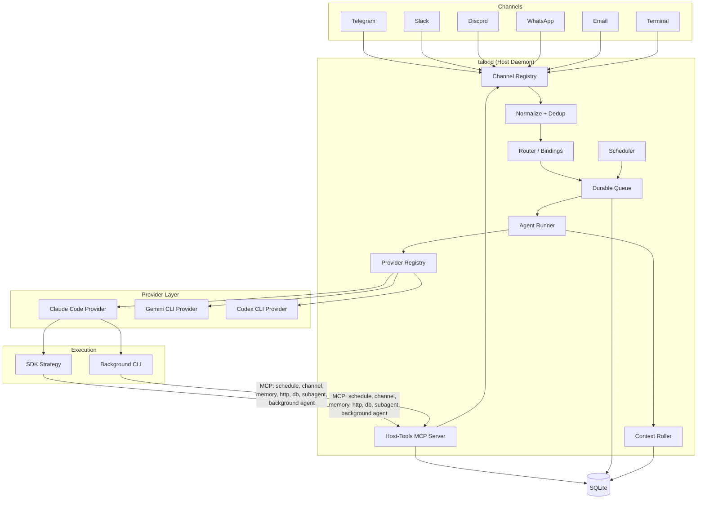
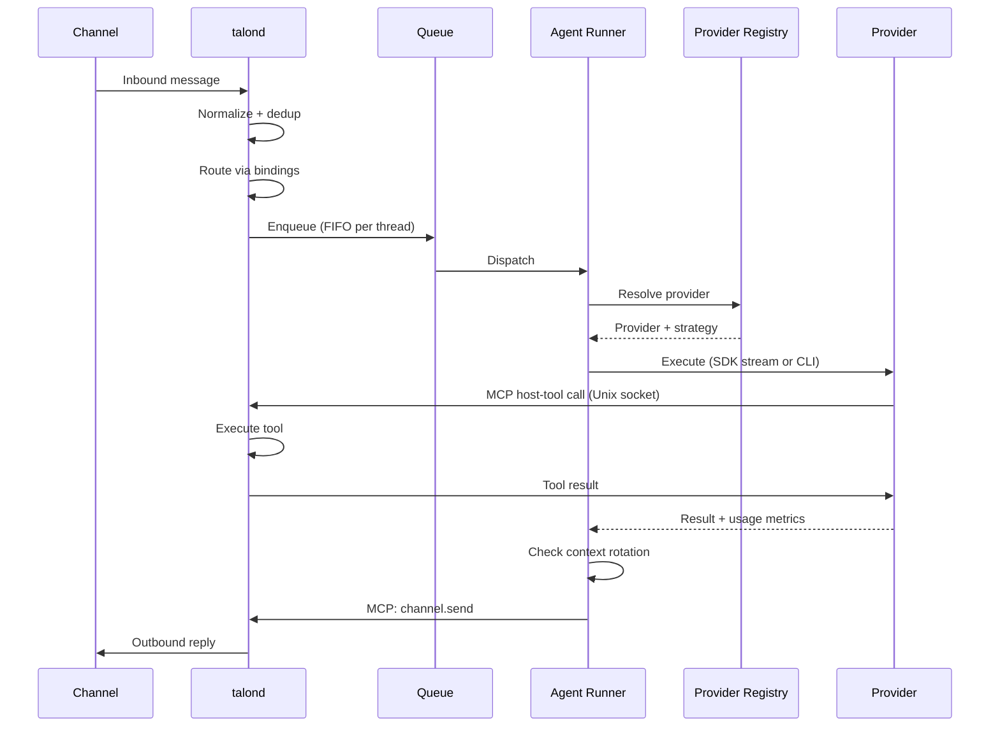
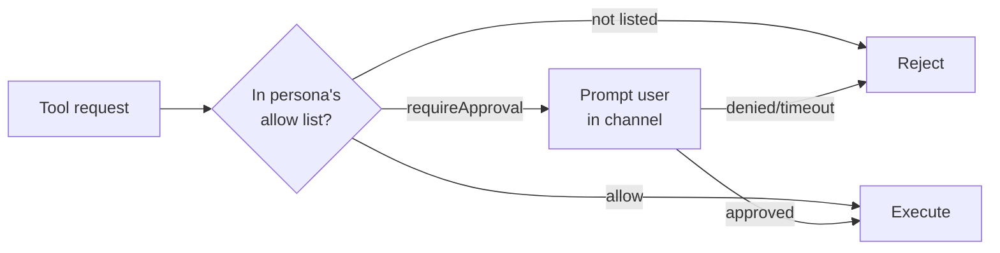
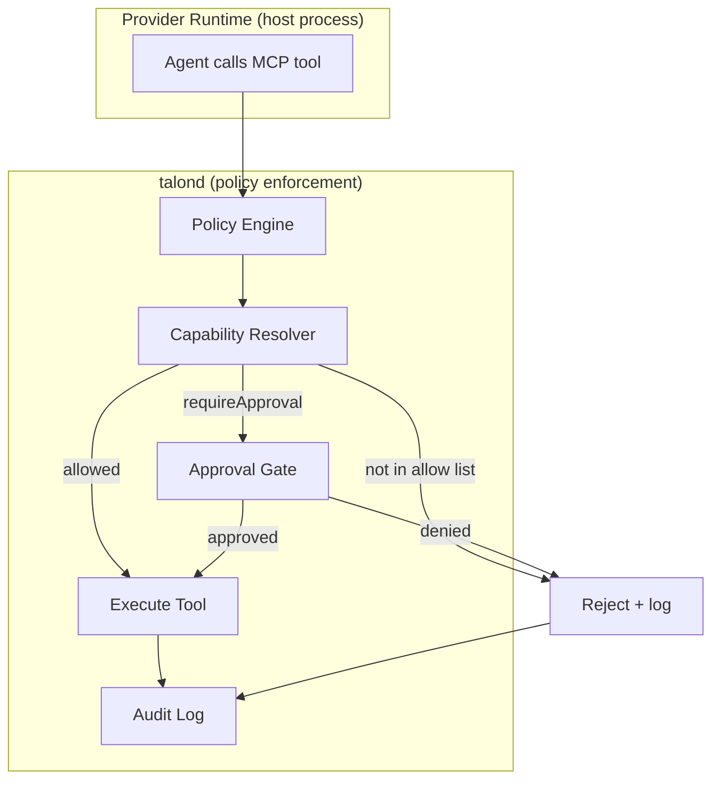
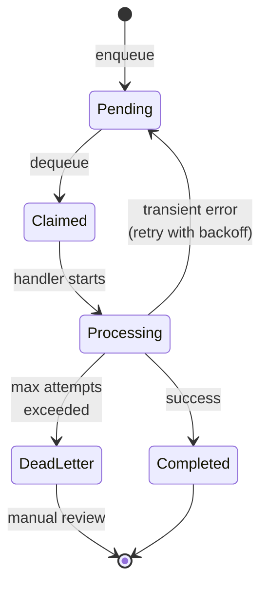

<p align="center">
    
  </p>

# Talon

**Resilient, secure, extensible autonomous agent daemon.**

[](#testing)
[](https://nodejs.org)
[](LICENSE)
[](https://www.typescriptlang.org)

---

## What is Talon?

Talon is a self-hosted daemon that orchestrates autonomous AI agents across multiple communication channels. You configure personas — each with their own system prompt, tools, and security policy — and bind them to channels like Telegram, Slack, Discord, WhatsApp, or email. Messages flow in, get routed to the right persona, executed by the configured provider runtime, and responses flow back out.

It is built for single-user or small-team deployments where you want persistent, always-on AI agents that you fully control — no cloud platform, no vendor lock-in, just a daemon on your server.

### Why Talon?

- **Self-hosted**: runs on your own hardware, your data stays with you
- **Resilient**: durable message queue survives crashes, automatic retry with exponential backoff, dead-letter handling
- **Secure**: capability-based access control — every tool call is policy-checked and audit-logged
- **Multi-channel**: one daemon handles Telegram, Slack, Discord, WhatsApp, email, and terminal simultaneously
- **Multi-persona**: different agents with different personalities, tools, and permissions on different channels

---

## Quick start (Docker)

The fastest way to run Talon — no clone, no build, no toolchain. Download
the starter bundle, add your tokens, and bring it up:

```bash
# 1. Download and extract the starter bundle
curl -fsSL https://github.com/ivo-toby/talon/releases/latest/download/talon-starter.tar.gz | tar xz
cd talon-starter

# 2. Install the talonctl helper (no sudo)
./install.sh

# 3. Configure
cp .env.example .env                              # add your bot token + provider key
cp config/talond.example.yaml config/talond.yaml  # set allowedChatIds, pick a provider

# 4. Run
docker compose up -d
talonctl status
```

The daemon image is published to `ghcr.io/ivo-toby/talond` — multi-arch
(linux/amd64 + linux/arm64), `:latest` plus per-release tags. The compose
file pulls it for you; there is nothing to build.

**Guided setup with Claude Code.** The bundle ships a setup skill — run
`claude` in the extracted folder and type `/talon-setup-docker` to be
walked through provider choice, channel config, and first boot
conversationally.

Full bundle reference: [`starter/README.md`](starter/README.md). Prefer
running from a source clone as a systemd service? See
[Quick start (from source)](#quick-start-from-source).

---

## Features

### Channels

- **Telegram** — Long polling with MarkdownV2 formatting
- **Slack** — Socket Mode with mrkdwn formatting
- **Terminal** — WebSocket server with `talonctl chat` client, rendered markdown output, persistent threads
- **Discord** — Gateway events with REST API, rate limit handling _(inbound not yet implemented)_
- **WhatsApp** — WhatsApp Web bridge via Baileys, supports dedicated number or self-chat mode
- **Email** — IMAP polling + SMTP send, thread tracking via In-Reply-To headers _(not yet tested)_

### Agent System

- **Persona-per-channel** — Each channel gets its own agent with a dedicated system prompt, model, tools, and capabilities
- **Provider-based execution** — Agents run through the configured provider runtime (Claude uses the Anthropic SDK path; Gemini and Codex use CLI strategies)
- **Per-thread memory** — Each conversation thread gets its own workspace with transcript, working memory, and artifacts
- **Skills** — Modular prompt and tool bundles with lazy loading (metadata-only in system prompt, full content on demand)
- **MCP integration** — Connect external MCP tool servers via stdio, policy-enforced through host-tools bridge

### Provider abstraction

Agent execution is decoupled from any specific SDK or CLI. A provider layer sits between the daemon core and the actual model runtime, so swapping or adding providers doesn't require changes to the runner, queue, or context management.

Each provider implements a small interface: prepare execution invocations, parse output, estimate context usage, and create a runtime execution strategy. The daemon resolves which provider to use from config, both for the main agent runner and for background agents independently. Claude Code is the default provider, and Gemini CLI, Codex CLI are supported as first-class providers. An **experimental** OpenAI-compatible provider (Mastra-backed) is available for Ollama, vLLM, Groq, and other OpenAI-compatible endpoints. Provider entries may also set `type` to reuse an implementation under a distinct provider name, for example `ollama-mac` with `type: openai-compatible` alongside an existing Ollama Cloud provider.

This matters because it means you can:

- Run different providers for foreground vs background work (e.g., Claude for interactive, a local model for batch tasks)
- Add new providers without touching core pipeline code — implement the interface, register in config, done
- Configure provider-specific context windows and context-management policy per agent-runner provider
- Keep provider defaults simple while failing fast on removed legacy `context` config that now requires migration

```yaml
agentRunner:
  defaultProvider: claude-code
  providers:
    claude-code:
      enabled: true
      command: claude
      contextWindowTokens: 200000
      contextManagement:
        enabled: true
        triggerMetric: cache_read_input_tokens
        thresholdRatio: 0.5
        recentMessageCount: 10
        summarizer: session-summarizer
    codex-cli:
      enabled: false
      command: codex
      contextWindowTokens: 400000
      contextManagement:
        enabled: true
        triggerMetric: cache_read_input_tokens
        thresholdRatio: 0.8
        recentMessageCount: 10
        summarizer: session-summarizer
      options:
        defaultModel: gpt-5.4
    openai-compatible: # experimental
      enabled: false
      command: node
      contextWindowTokens: 256000
      contextManagement:
        enabled: true
        triggerMetric: input_tokens
        thresholdRatio: 0.75
        recentMessageCount: 10
        summarizer: session-summarizer
      options:
        baseUrl: http://127.0.0.1:11434/v1
        defaultModel: qwen3-coder:30b
        providerId: ollama
    ollama-mac: # alias using the same implementation
      enabled: false
      type: openai-compatible
      command: node
      contextWindowTokens: 128000
      contextManagement:
        enabled: true
        triggerMetric: input_tokens
        thresholdRatio: 0.75
        recentMessageCount: 10
        summarizer: session-summarizer
      options:
        baseUrl: http://mac.local:11434/v1
        defaultModel: qwen3-coder:30b
        providerId: ollama-mac
        providerOptions:
          chat_template_kwargs:
            enable_thinking: false

backgroundAgent:
  enabled: true
  maxConcurrent: 3
  defaultProvider: claude-code
  providers:
    claude-code:
      enabled: true
      command: claude
      contextWindowTokens: 200000
    codex-cli:
      enabled: false
      command: codex
      contextWindowTokens: 400000
      options:
        defaultModel: gpt-5.4
    openai-compatible:
      enabled: false
      command: node
      contextWindowTokens: 256000
      options:
        baseUrl: http://127.0.0.1:11434/v1
        defaultModel: qwen3-coder:30b
        providerId: ollama
    ollama-mac:
      enabled: false
      type: openai-compatible
      command: node
      contextWindowTokens: 128000
      options:
        baseUrl: http://mac.local:11434/v1
        defaultModel: qwen3-coder:30b
        providerId: ollama-mac
        providerOptions:
          chat_template_kwargs:
            enable_thinking: false
```

### Infrastructure

- **Durable queue** — SQLite-backed message queue with crash recovery, retry, and dead-letter
- **Scheduler** — Agent-managed cron, interval, and one-shot scheduled tasks
- **Host-tools MCP bridge** — Built-in host tools (schedule, channel, memory, http, db, execution env, subagent, background agent) exposed via Unix socket
- **Sub-agent system** — Route mechanical LLM tasks (summarization, memory grooming, search) to cheap models via pluggable sub-agents
- **Background agents** — Launch long-running provider workers for deep tasks without blocking the foreground conversation
- **Sandboxed execution environments** — Isolate background agent work in persistent Firecracker VMs via [Sprites.dev](https://sprites.dev), with file transfer, checkpointing, and automatic cleanup
- **Durable lifecycle pipeline** — Publish bounded daemon events for context rotation, behavior learning, telemetry, replay, and governed prompt promotion without letting model-backed handlers mutate state directly
- **Hot reload** — Change config, personas, and skills without restarting the daemon
- **Systemd integration** — Watchdog heartbeat, graceful shutdown, timer-based wake-only mode
- **Session persistence** — Resumable agent sessions resume across messages in the same thread, scoped by provider, model, and configured reasoning effort so model or effort swaps start fresh
- **Provider-scoped context management** — Per-provider session rotation policy for latency or cost control, with compressed history injection into fresh sessions

### Observability (Langfuse)

- **Trace every agent run** — Each message-to-response cycle becomes a Langfuse trace with spans for agent execution, tool calls, and LLM generations
- **OpenTelemetry-native** — Built on the `@langfuse/otel` span processor and the standard `NodeTracerProvider`
- **No overhead when disabled** — A noop service replaces the real one; no Langfuse initialization or network traffic
- **Self-hosted or cloud** — Point `baseUrl` at your own Langfuse instance or use Langfuse Cloud

### Security

- **Default-deny capabilities** — Tools are gated by capability labels (`channel.send`, `schedule.manage`, etc.)
- **Approval gates** — High-risk actions prompt for user approval in-channel before executing
- **Secrets management** — Credentials via `${ENV_VAR}` substitution, never hardcoded in config
- **Audit logging** — Every side-effecting operation recorded with full provenance

---

## Architecture

Messages arrive from channels, pass through a durable queue, and get dispatched to the agent runner. The runner resolves a provider from the registry and executes via that provider's strategy (SDK streaming or CLI). Agents interact with the host through MCP host-tools on a Unix socket. Background agents run as separate provider-managed processes. For the compact maintainer map, see [`selfdoc.md`](selfdoc.md).



### Message flow



---

## Quick start (from source)

Run Talon from a clone — the path for native/systemd deployments and
local development. For the zero-build container path, see
[Quick start (Docker)](#quick-start-docker) above.

For the full deployment walkthrough, see the [setup guide](docs/setup-guide.md).

### Prerequisites

- **Node.js 24+**
- **Claude Code** (default provider), and optionally **Gemini CLI** and/or **Codex CLI** installed and authenticated
- **SQLite** (ships with better-sqlite3, no separate install)

### Install

```bash
git clone https://github.com/ivo-toby/talon.git
cd talon
npm install
npm run build
```

### First-Time Setup

```bash
# Run interactive setup — checks environment, creates directories, generates config
npx talonctl setup

# Add a Telegram channel
npx talonctl add-channel --name my-telegram --type telegram

# Add a persona (copies system.md from templates/ if available)
npx talonctl add-persona --name assistant

# Run database migrations
npx talonctl migrate

# Check everything is ready
npx talonctl doctor
```

### Start the Daemon

```bash
# Direct
node dist/index.js --config talond.yaml

# Or via npm
npm run talond
```

---

## Configuration

Talon uses a single YAML configuration file. A fully annotated example ships at [`talond.yaml.example`](talond.yaml.example).

### Minimal Configuration

```yaml
storage:
  type: sqlite
  path: data/talond.sqlite

queue:
  maxAttempts: 3
  backoffBaseMs: 1000
  backoffMaxMs: 60000
  concurrencyLimit: 5

backgroundAgent:
  enabled: true
  maxConcurrent: 3
  defaultTimeoutMinutes: 30
  claudePath: claude # legacy shortcut for claude-code; prefer defaultProvider + providers

personas:
  - name: assistant
    model: claude-sonnet-4-6
    systemPromptFile: personas/assistant/system.md
    skills: []
    subagents:
      - session-summarizer
      - memory-groomer
      - memory-retriever
      - file-searcher
    capabilities:
      allow:
        - channel.send:telegram
        - fs.read:*
        - memory.access:*
        - subagent.invoke:*
        - subagent.background
      requireApproval:
        - fs.write:workspace
    maxConcurrent: 2

channels:
  - name: my-telegram
    type: telegram
    enabled: true
    config:
      token: ${TELEGRAM_BOT_TOKEN}
      allowedUserIds:
        - 123456789
      pollIntervalMs: 1000

scheduler:
  tickIntervalMs: 5000

auth:
  mode: subscription
  providers:
    anthropic:
      apiKey: ${SUBAGENT_ANTHROPIC_API_KEY}
    openai:
      apiKey: ${OPENAI_API_KEY}

agentRunner:
  defaultProvider: claude-code
  providers:
    claude-code:
      enabled: true
      command: claude
      contextWindowTokens: 1000000
      contextManagement:
        enabled: true
        triggerMetric: cache_read_input_tokens
        thresholdRatio: 0.5
        recentMessageCount: 10
        summarizer: session-summarizer
    openai-compatible: # experimental
      enabled: false
      command: node
      contextWindowTokens: 256000
      contextManagement:
        enabled: true
        triggerMetric: input_tokens
        thresholdRatio: 0.75
        recentMessageCount: 10
        summarizer: session-summarizer
      options:
        baseUrl: http://127.0.0.1:11434/v1
        defaultModel: qwen3-coder:30b
        providerId: ollama

logLevel: info
dataDir: data
```

### Configuration Sections

| Section                | Purpose                                                                       |
| ---------------------- | ----------------------------------------------------------------------------- |
| `storage`              | Database backend and SQLite path                                              |
| `queue`                | Retry/backoff/concurrency controls for durable queue processing               |
| `agentRunner`          | Foreground provider config, including provider-scoped context management      |
| `backgroundAgent`      | Enable and tune long-running background provider workers                      |
| `personas`             | Persona profiles: model, system prompt, skills, capabilities                  |
| `channels`             | Channel connector entries with `type`, `name`, and connector `config` payload |
| `bindings`             | Channel-to-persona routing with default persona per channel                   |
| `schedules`            | Agent-managed schedule entries (cron, interval, one-shot)                     |
| `scheduler`            | Scheduler tick interval                                                       |
| `auth`                 | `subscription` or `api_key` authentication mode                               |
| `langfuse`             | Langfuse observability: API keys, base URL, environment, flush settings       |
| `sprites`              | Sprites.dev execution environments: token, resource limits, defaults          |
| `logLevel` / `dataDir` | Runtime logging level and data root                                           |

For the context-management strategies and migration details, see [docs/context-management.md](docs/context-management.md).

### Environment Variable Substitution

Credential fields support `${ENV_VAR}` syntax so you never hardcode secrets:

```yaml
channels:
  - name: my-telegram
    type: telegram
    config:
      botToken: ${TELEGRAM_BOT_TOKEN}
```

---

### Background Agent Workers

Talon includes a `background_agent` host tool for work that should keep running after the foreground turn returns. Typical examples are repo-wide refactors, large code searches, or longer research/coding tasks that should not block the active conversation.

This was added because Talon already had two extremes:

- the normal foreground agent turn, which is interactive and should stay responsive
- short synchronous sub-agents, which are useful for mechanical delegation but intentionally limited

Some tasks need the full provider CLI runtime and the persona's prompt + external MCP context, but they should still run out-of-band. Background agents fill that gap: the foreground agent starts a worker, gets a task ID immediately, and Talon tracks the worker to completion in SQLite.

The lifecycle is durable:

- Talon persists task state in the database
- the daemon enforces a concurrency limit
- completion, failure, timeout, and cancellation are recorded
- the originating thread gets a normal completion message through the existing queue and channel-send path

Background workers get a filtered version of Talon's host-tools MCP server based on the persona's capabilities. The `background_agent` tool is always excluded to prevent recursive spawning. When `sandbox=true`, the worker also gets the `execution_env` tool for running commands, transferring files, and checkpointing inside an isolated Sprite VM.

For sandboxed execution environments, see [Execution Environments (Sprites)](#execution-environments-sprites) below.

#### Configuration

```yaml
backgroundAgent:
  enabled: true
  maxConcurrent: 3
  defaultTimeoutMinutes: 30
  defaultProvider: claude-code
  providers:
    claude-code:
      enabled: true
      command: claude
      contextWindowTokens: 200000
    # Any of the other providers (gemini-cli, codex-cli, openai-compatible)
    # can be enabled here the same way they are in `agentRunner.providers`.
```

| Option                  | Meaning                                                          |
| ----------------------- | ---------------------------------------------------------------- |
| `enabled`               | Globally enable or disable background workers                    |
| `maxConcurrent`         | Maximum number of background provider workers allowed at once    |
| `defaultTimeoutMinutes` | Default wall-clock timeout when a tool call does not provide one |
| `defaultProvider`       | Provider used for tasks that do not specify one explicitly       |
| `providers`             | Per-provider config; mirrors `agentRunner.providers`             |

##### Per-persona override

Personas can route their background agents through a different provider/model than their foreground runtime by setting `backgroundProvider` and (optionally) `backgroundModel`:

```yaml
personas:
  - name: assistant
    model: qwen3-coder:30b
    provider: openai-compatible # foreground stays on Ollama
    backgroundProvider: claude-code # background runs on Claude Code
    backgroundModel: claude-sonnet-4-6
  - name: work-context-manager
    model: qwen3-coder:30b
    provider: openai-compatible
    # no backgroundProvider — falls back to backgroundAgent.defaultProvider
```

`backgroundProvider` must be enabled under `backgroundAgent.providers`; the daemon refuses to start otherwise. `backgroundModel` is paired with `backgroundProvider` — setting it without `backgroundProvider` is rejected at config load. When a background run resolves its provider/model from persona configuration, Talon also forwards that persona's `reasoningEffort`; explicitly supplied background provider/model tool arguments do not inherit it.

Resolution order at spawn time:

1. Provider given explicitly in the `background_agent` tool call (strict)
2. Persona's `backgroundProvider`
3. Persona's foreground `provider` — **only** if it is also enabled in `backgroundAgent.providers`
4. `backgroundAgent.defaultProvider`

##### Using `openai-compatible` for background agents

`openai-compatible` (**experimental**) works as a background provider alongside the foreground `agentRunner` entry. Add it under `backgroundAgent.providers` the same way you would for the main agent:

```yaml
backgroundAgent:
  enabled: true
  maxConcurrent: 2
  defaultTimeoutMinutes: 30
  defaultProvider: openai-compatible # or keep claude-code and opt in per task
  providers:
    openai-compatible:
      enabled: true
      command: node # the bundled wrapper runs under node
      contextWindowTokens: 256000
      options:
        baseUrl: ${OLLAMA_BASE_URL} # e.g. https://ollama.com/v1
        defaultModel: ${OLLAMA_AGENT_MODEL}
        providerId: ollama # triggers auth.providers.ollama lookup
```

Notes:

- **Credentials are shared.** The background factory resolves them the same way the foreground one does — `auth.providers.<options.providerId>` first (e.g. `auth.providers.ollama`), falling back to `auth.providers.openai-compatible`. Nothing extra under `auth:` is needed if the agentRunner entry already works.
- **Background runs don't stream.** The wrapper still runs Mastra's streaming API internally, but only emits a terminal summary on stdout and writes the full response to a temp `last-message.txt` file. This bypasses the 100 KB stdout buffer cap, so long outputs are never truncated.
- **Tool calls still execute.** The background worker uses the same filtered host-tools MCP bridge as `claude-code`/`codex-cli` background workers; per-persona capabilities apply. Tool-call messages just aren't streamed to a channel because background runs don't have a live connection.
- **Per-task override.** If you'd rather keep `defaultProvider: claude-code` and only route specific tasks through `openai-compatible`, pass the provider explicitly when dispatching the background task (same mechanism as routing to `codex-cli`).

To let a persona use the feature, grant `subagent.background`:

```yaml
personas:
  - name: assistant
    capabilities:
      allow:
        - subagent.background
```

---

## Channel Connectors

Each connector implements the `ChannelConnector` interface: `start()`, `stop()`, `onMessage()`, `send()`, and `format()`. All connectors convert Markdown output to channel-native formatting automatically.

#### Common Channel Options

Every channel entry supports these optional top-level fields in addition to the connector-specific `config` block:

| Option          | Type    | Default | Description                                                                   |
| --------------- | ------- | ------- | ----------------------------------------------------------------------------- |
| `enabled`       | boolean | `true`  | Enable or disable the channel                                                 |
| `showToolCalls` | boolean | `false` | Send a human-readable message to the channel each time the agent calls a tool |

When `showToolCalls` is enabled, each tool invocation produces a short status message in the channel (e.g. _"🌐 Using Brave Search: query"_), giving users visibility into what the agent is doing behind the scenes.

```yaml
channels:
  - name: my-channel
    type: slack
    showToolCalls: true # sends a message like "🌐 Using Brave Search: web search" on each tool call
    config:
      botToken: ${SLACK_BOT_TOKEN}
      appToken: ${SLACK_APP_TOKEN}
```

### Telegram

Long-polling connector using the Telegram Bot API.

```yaml
channels:
  - name: my-telegram
    type: telegram
    enabled: true
    config:
      botToken: ${TELEGRAM_BOT_TOKEN}
      pollingTimeoutSec: 30
      allowedChatIds:
        - 123456789
```

- **Inbound**: Long polling via `getUpdates`
- **Outbound**: `sendMessage` with MarkdownV2 parse mode
- **Idempotency key**: `update_id`
- **Thread mapping**: `chat_id`

### Slack

Event-driven connector for Slack's Events API or Socket Mode.

```yaml
channels:
  - name: my-slack
    type: slack
    enabled: true
    config:
      botToken: ${SLACK_BOT_TOKEN}
      appToken: ${SLACK_APP_TOKEN}
      signingSecret: ${SLACK_SIGNING_SECRET}
```

- **Inbound**: Events API webhooks or Socket Mode
- **Outbound**: `chat.postMessage` Web API
- **Idempotency key**: `event_id` > `client_msg_id` > `channel:ts`
- **Thread mapping**: `channel_id:thread_ts`
- **Format**: Slack mrkdwn (`*bold*`, `_italic_`, `` `code` ``)

### Discord

> **Not yet implemented**: The connector has send support and a `feedEvent()` ingestion method, but no Gateway WebSocket client to actually receive events from Discord. Needs a Gateway client similar to the Slack Socket Mode implementation. See TASK-043.

Push-based connector using the Discord Gateway and REST API.

```yaml
channels:
  - name: my-discord
    type: discord
    enabled: true
    config:
      botToken: ${DISCORD_BOT_TOKEN}
      applicationId: '123456789'
      allowedChannelIds:
        - '987654321'
```

- **Inbound**: Gateway `MESSAGE_CREATE` events
- **Outbound**: REST API `POST /channels/{id}/messages`
- **Idempotency key**: Message snowflake ID
- **Thread mapping**: `channel_id:message_id`
- **Rate limiting**: Automatic retry with `Retry-After` header handling

### WhatsApp Business (Cloud API)

Meta Cloud API connector with an embedded webhook HTTP server for inbound events. Requires a Meta Business account with a WhatsApp-enabled phone number.

```yaml
channels:
  - name: my-whatsapp-business
    type: whatsappBusiness
    enabled: true
    config:
      phoneNumberId: '123456789'
      accessToken: ${WHATSAPP_ACCESS_TOKEN}
      verifyToken: ${WHATSAPP_VERIFY_TOKEN}
      appSecret: ${WHATSAPP_APP_SECRET} # enables inbound webhook server
      webhookPort: 3000 # default: 3000
      webhookHost: '0.0.0.0' # default: 0.0.0.0
      webhookPath: '/webhook' # default: /webhook
```

- **Inbound**: Embedded HTTP server handles Meta webhook verification (GET) and signed event delivery (POST with HMAC-SHA256 validation). Requires a public URL — use a reverse proxy (nginx, Caddy) or ngrok for local dev.
- **Outbound**: REST API `POST /v21.0/{phoneNumberId}/messages`
- **Idempotency key**: WhatsApp message ID
- **Thread mapping**: Sender phone number

### WhatsApp Baileys

WhatsApp Web bridge using the [Baileys](https://github.com/WhiskeySockets/Baileys) library. Connects as a regular WhatsApp Web client — no Meta Business account, no webhook server, no Cloud API.

> **Optional dependency**: `@whiskeysockets/baileys` is not bundled. Install it separately: `npm install @whiskeysockets/baileys`

Two usage modes: **dedicated number** (default) or **self-chat** (use your personal WhatsApp).

**Dedicated number** — a second WhatsApp account receives messages from others:

```yaml
channels:
  - name: my-whatsapp
    type: whatsappBaileys
    enabled: true
    config:
      authDir: './baileys-auth'
      allowedSenders: # Restrict who can message the bot
        - '96490886312027'
```

**Self-chat** — the bot listens in your own "Message Yourself" thread. No second phone needed:

```yaml
channels:
  - name: my-whatsapp
    type: whatsappBaileys
    enabled: true
    config:
      authDir: './baileys-auth'
      selfChat: true
      triggerWords: ['@Talon'] # Optional — filter by trigger word
```

#### Self-Chat Mode

Set `selfChat: true` to use your personal WhatsApp number. The bot only listens to messages you send in your own "Message Yourself" conversation (WhatsApp's built-in self-chat). All other conversations are ignored. No `allowedSenders` needed — only your own messages are processed.

#### Trigger Words

`triggerWords` filters messages so only those starting with a listed word are processed. The trigger word is stripped before the message reaches the agent — e.g. `@Talon what's the weather?` becomes `what's the weather?`. Case-insensitive.

Useful in self-chat mode (so not every note-to-self triggers the bot) or with a dedicated number in group-like scenarios. When omitted or empty, all messages pass through.

#### Access Control

For dedicated-number mode, use `allowedSenders` to restrict who can message the bot. When omitted or empty, all senders are accepted.

**Finding sender IDs:** WhatsApp uses opaque "LID" identifiers (e.g. `96490886312027@lid`) rather than phone numbers in many cases. You cannot predict which format a contact will use, so discover IDs from the logs:

1. Set `logLevel: debug` in `talond.yaml`
2. Start (or restart) talond
3. Send a test message from each phone that should be allowed
4. Find the log line `whatsapp-baileys: inbound message received` — the `jid` field shows the full identifier
5. Copy the part **before the `@`** (e.g. `96490886312027`) into `allowedSenders`
6. Set `logLevel` back to `info` and restart

#### Authentication

Baileys authenticates by scanning a QR code, like linking a new device in WhatsApp. Use the standalone CLI command to authenticate before starting the daemon:

```bash
# Authenticate — prints QR code, waits for scan, saves credentials
npx talonctl whatsapp-auth --auth-dir ./baileys-auth

# Custom timeout (default: 120s)
npx talonctl whatsapp-auth --auth-dir ./baileys-auth --timeout 180
```

Once authenticated, the daemon uses the saved credentials — no QR code display needed at runtime. To re-authenticate, delete the `authDir` folder and run the command again.

- **Access control**: Optional `allowedSenders` allowlist (dedicated-number mode) or `selfChat: true` (personal number)
- **Trigger words**: Optional `triggerWords` filter — trigger is stripped before reaching the agent
- **Inbound**: WhatsApp Web socket via Baileys, text messages from individual chats only (group and media messages logged and skipped in v1)
- **Outbound**: Send via Baileys socket using WhatsApp JID (e.g. `447700900000@s.whatsapp.net`)
- **Idempotency key**: Baileys message ID
- **Thread mapping**: Sender JID
- **Reconnection**: Automatic on disconnect; logged-out sessions require re-authentication (delete `authDir` and re-run `talonctl whatsapp-auth`)

### Email

> **Not yet tested**: The connector has IMAP polling and SMTP send implementations, but has not been tested end-to-end. See TASK-049.

Dual-mode connector with IMAP polling and SMTP outbound.

```yaml
channels:
  - name: my-email
    type: email
    enabled: true
    config:
      imapHost: imap.gmail.com
      imapPort: 993
      imapUser: agent@example.com
      imapPass: ${EMAIL_PASSWORD}
      imapSecure: true
      smtpHost: smtp.gmail.com
      smtpPort: 587
      smtpUser: agent@example.com
      smtpPass: ${EMAIL_PASSWORD}
      smtpSecure: false
      fromAddress: 'Talon <agent@example.com>'
```

- **Inbound**: IMAP polling (or webhook via `feedInbound()`)
- **Outbound**: SMTP with HTML formatting
- **Idempotency key**: `Message-ID` header
- **Thread mapping**: `In-Reply-To` / `References` headers
- **Format**: Markdown to HTML conversion

### Terminal

WebSocket-based connector for direct CLI access to any persona. Connect from any machine with `talonctl chat`.

```yaml
channels:
  - name: my-terminal
    type: terminal
    enabled: true
    config:
      port: 7700
      host: 0.0.0.0
      token: ${TERMINAL_TOKEN}
```

- **Inbound**: WebSocket JSON messages from `talonctl chat`
- **Outbound**: JSON response over WebSocket, client renders with `marked-terminal`
- **Auth**: Shared token with constant-time comparison, 64KB max payload, 10s auth timeout
- **Thread mapping**: `clientId` — same client always gets the same conversation thread
- **Persona override**: `--persona` flag switches persona at connect time
- **Format**: Raw markdown passthrough (client handles rendering)

#### Connecting

```bash
# Set token via env var or --token flag
export TERMINAL_TOKEN=your-secret-token

# Connect to a running Talon instance
talonctl chat --host 10.0.1.95 --port 7700 --persona assistant

# Or with explicit token
talonctl chat --host 10.0.1.95 --port 7700 --token your-secret-token

# Custom client ID for persistent thread identity
talonctl chat --host 10.0.1.95 --port 7700 --client-id my-laptop
```

The client provides:

- Rendered markdown output via `marked-terminal`
- Typing spinner (`ora`) while the agent works
- Persistent conversation — reconnecting with the same `clientId` resumes the thread
- Graceful disconnect on Ctrl+C

---

## Multi-Connector Setup

You can run N connector instances of the same channel type — for example, multiple Slack bots — each with its own credentials and default persona binding. Channels are identified by `name` (unique), not by `type`.

### Use cases

- **Virtual team** — deploy per-persona bots in a single Slack workspace: PM-bot, Dev-bot, Content-bot, each responding in character.
- **Per-persona Telegram bots** — multiple bots in a shared group, each bound to a different persona.

### Configuration

Add multiple entries of the same `type` under `channels:`, give each a unique `name`, and create a `bindings:` entry for each:

```yaml
channels:
  - name: slack-pm
    type: slack
    enabled: true
    config:
      botToken: ${SLACK_PM_BOT_TOKEN}
      appToken: ${SLACK_PM_APP_TOKEN}
      signingSecret: ${SLACK_PM_SIGNING_SECRET}

  - name: slack-dev
    type: slack
    enabled: true
    config:
      botToken: ${SLACK_DEV_BOT_TOKEN}
      appToken: ${SLACK_DEV_APP_TOKEN}
      signingSecret: ${SLACK_DEV_SIGNING_SECRET}

bindings:
  - persona: product-manager
    channel: slack-pm
    isDefault: true
  - persona: developer
    channel: slack-dev
    isDefault: true
```

### Bot-self filtering

Connectors automatically filter inbound messages from all bot accounts to prevent feedback loops — no configuration needed:

- **Slack** — drops all messages with a `bot_id` field.
- **Discord** — drops all messages from `author.bot` accounts.
- **Telegram** — drops all messages where `from.is_bot` is true.
- **WhatsApp Baileys** — filters via JID-based self-detection.

WhatsApp Business (Cloud API) does not implement bot-self filtering; avoid running multiple Talon bots that share the same WhatsApp Business account.

### Channel routing

The `channel_send` tool routes by channel `name`, so a persona bound to `slack-pm` posts through the PM bot identity and a persona bound to `slack-dev` posts through the Dev bot identity.

### WhatsApp note

If you run multiple WhatsApp Business connectors with inbound webhooks, each must use a unique `webhookPort`.

---

## Personas

A persona defines an AI agent's identity, capabilities, and channel bindings. Bindings are managed separately via `talonctl bind`.

```yaml
personas:
  - name: alfred
    description: Personal assistant
    model: claude-sonnet-4-6
    provider: claude-code
    # Optional for Codex CLI and OpenAI-compatible Responses personas.
    # OpenAI Responses: none, minimal, low, medium, high, xhigh.
    # Codex CLI: minimal, low, medium, high, xhigh.
    # reasoningEffort: medium
    systemPromptFile: personas/alfred/system.md
    skills:
      - web-search
      - calendar
    capabilities:
      allow:
        - channel.send:telegram
        - channel.send:slack
        - net.http
        - schedule.manage
        - memory.access
      requireApproval:
        - db.query

bindings:
  - persona: alfred
    channel: my-telegram
    isDefault: true
  - persona: alfred
    channel: my-slack
    isDefault: true
```

`reasoningEffort` is a persona-level knob for Codex CLI and OpenAI-compatible Responses providers. Talon rejects it at config load for unsupported providers and OpenAI-compatible chat-completions mode. Codex CLI accepts `minimal`, `low`, `medium`, `high`, and `xhigh`; omit the field to use the provider default because Codex CLI does not support `none`. OpenAI-compatible Responses also accepts `none`. Use the base model name in `model`; Talon does not support model-name suffix aliases for effort levels.

### Persona templates

Default system prompt templates live in `templates/<name>/system.md` and are safe to commit. The `personas/` directory is gitignored — personal prompts stay local.

When creating a persona, `add-persona` checks `templates/<name>/system.md` first. If a named template exists it is copied to `personas/<name>/system.md`; otherwise a generic starter prompt is generated. Existing files are never overwritten — your customisations are safe.

### Capability Labels

Tools are gated by scoped capability labels. Capabilities are listed in `allow` or `requireApproval` arrays — anything not listed is denied by default.

| Capability               | Description                                                                 |
| ------------------------ | --------------------------------------------------------------------------- |
| `channel.send:<channel>` | Send messages to a specific channel                                         |
| `persona.send:*`         | Delegate to another persona, list personas, and fetch delegated task status |
| `schedule.manage`        | Create/modify/delete scheduled tasks                                        |
| `memory.access`          | Read/write per-thread structured memory                                     |
| `net.http`               | Fetch external URLs                                                         |
| `db.query`               | Execute read-only database queries                                          |
| `subagent.invoke`        | Invoke sub-agents for delegated tasks                                       |
| `subagent.background`    | Launch and manage background workers                                        |
| `execution.env`          | Manage sandboxed Sprite execution environments                              |

### Capability Resolution

When an agent requests a tool:



---

## Skills

Skills are modular bundles of prompts, tools, and configuration that snap onto personas. Skills use **lazy loading** — only metadata (name + description) is injected into the system prompt. Full instructions are loaded on demand when the agent calls the `skill_load` tool.

### Skill Formats

Two on-disk formats are supported:

**SKILL.md** (recommended) — single file with YAML frontmatter:

```
skills/<skill_name>/
  SKILL.md             # YAML frontmatter + markdown instructions
  mcp/*.json           # MCP server definitions (optional)
  tools/*.yaml         # tool manifests (optional)
  migrations/*.sql     # DB migrations (optional)
```

**skill.yaml + prompts/** (legacy) — separate manifest and prompt files:

```
skills/<skill_name>/
  skill.yaml           # metadata, required capabilities
  prompts/*.md         # prompt instruction fragments
  mcp/*.json           # MCP server definitions (optional)
  tools/*.yaml         # tool manifests (optional)
  migrations/*.sql     # DB migrations (optional)
```

### Adding a Skill

```bash
# SKILL.md format (recommended)
npx talonctl add-skill --name web-search --persona assistant --format skillmd

# Legacy YAML format
npx talonctl add-skill --name web-search --persona assistant
```

### Lazy Loading

Only skill name and description are included in the agent's system prompt per run. When the agent needs a skill's full instructions, it calls `skill_load`. MCP servers from skills still connect eagerly at startup.

| Scenario           | Eager (old) | Lazy (current) |
| ------------------ | ----------- | -------------- |
| 7 skills, using 1  | ~21k tokens | ~3.7k tokens   |
| 20 skills, using 0 | ~60k tokens | ~2k tokens     |

Background agents use eager loading to ensure full access without calling `skill_load`.

#### Per-skill eager opt-in

Some skills describe reflexive behaviors (e.g. "search memory before answering") that smaller models miss when only the description is available. Mark such a skill `eager: true` in its `SKILL.md` frontmatter (or `skill.yaml`) and its full body is merged into the persona system prompt at startup — the rest of the persona's skills stay lazy.

```yaml
---
name: my-skill
description: Use when …
eager: true
---
```

Defaults to `false`. Useful when a persona runs on a model that doesn't reliably autonomously call `skill_load` for indirect triggers (most open-weight ≤70B-effective models).

### Skill Resolution

Persona capabilities and skill requirements are intersected at runtime:

```
granted = persona.capabilities ∩ skill.requiredCapabilities
```

Skills with unmet capabilities produce a warning at startup and are skipped.

### HTTP MCP Servers and OAuth

For HTTP / SSE MCP servers that require OAuth (e.g. Glean, GitHub Enterprise),
Talon owns the token lifecycle directly — no `mcp-remote` or other stdio
bridge process at runtime.

The interactive OAuth dance lives in `talonctl auth-mcp`, runs once per
server, and writes a refreshable token bundle into Talon's data dir. The
daemon reads + refreshes that bundle on every agent run and injects the
resulting `Authorization: Bearer <token>` header into the MCP server config
before the provider sees it. Providers (claude-code, gemini-cli, codex-cli,
openai-compatible) stay completely unaware of the OAuth flow.

**Skill config shape:**

```json
{
  "name": "glean",
  "config": {
    "name": "glean",
    "transport": "http",
    "url": "https://contentful-be.glean.com/mcp/default",
    "auth": { "kind": "oauth2" }
  }
}
```

The skill loader stamps `auth.tokenStore: "<skillName>/<serverName>"` when
omitted. Token bundles live at `<dataDir>/mcp-auth/<tokenStore>.json` (mode
0600, atomic temp+rename writes).

**One-time authorisation:**

```bash
# Interactive (operator's desktop — opens local browser)
npx talonctl auth-mcp glean:glean

# Headless (operator on the daemon's host over SSH)
npx talonctl auth-mcp glean:glean --headless
# Prints the auth URL plus an `ssh -L <port>:localhost:<port> server`
# command. Run the SSH forward from your local machine, then open the URL
# in your local browser — the callback comes back over the forward.
```

The command performs Dynamic Client Registration (RFC 7591) when the
server advertises a `registration_endpoint`, generates a PKCE challenge,
runs the standard authorisation-code flow, and persists the resulting
access + refresh tokens. After it completes, the daemon picks up the new
bundle on the next agent run — no daemon restart required.

**Refresh:** the daemon automatically refreshes access tokens that fall
within 60 s of expiry, using the cached `refresh_token` and the OAuth
provider's `token_endpoint`. If both access and refresh have expired,
agent runs fail loudly with a "re-run `talonctl auth-mcp`" message.

---

## Sub-Agents

### Why Sub-Agents?

The main agent (Claude Sonnet) is powerful but expensive. Many tasks it performs are mechanical — searching files, retrieving memories, grooming stale data, summarizing transcripts. These don't need Sonnet-level reasoning; a cheaper model like Haiku can handle them in a fraction of the cost and time.

Sub-agents solve this by offloading specific, well-scoped tasks to cheap models. The main agent stays focused on conversation and decision-making, while sub-agents handle the grunt work and return structured results. This keeps per-message costs low without sacrificing capability.

### How Sub-Agents Work

1. The main agent calls `subagent_invoke` via MCP, specifying a sub-agent name and input
2. The daemon validates that the persona is assigned this sub-agent and has the required capabilities
3. The **ModelResolver** creates a Vercel AI SDK model instance for the sub-agent's configured provider
4. The sub-agent's `run()` function executes with a system prompt, model, and injected services
5. Results flow back to the main agent as structured data

### Model Overrides and Failover

By default, each sub-agent uses the model declared in its `subagent.yaml` manifest. Operators can override this in `talond.yaml` without editing manifests, and configure an ordered failover chain so if the primary model is unavailable, the next is tried automatically.

```yaml
subagents:
  memory-groomer:
    model:
      - provider: ollama
        name: qwen3-30b
        # maxTokens: 4096     # optional — falls back to subagent.yaml default
        # timeoutMs: 120000   # optional per-model wall-clock timeout (min 1000)
      - provider: anthropic
        name: claude-haiku-4-5-20251001
  session-summarizer:
    model:
      - provider: openai
        name: gpt-5.4-spark
```

**Per-model fields:**

| Field             | Purpose                                                                                                                  |
| ----------------- | ------------------------------------------------------------------------------------------------------------------------ |
| `provider`        | Provider slot: `anthropic`, `openai`, `google`, or `ollama` (required)                                                   |
| `name`            | Model name as the provider expects it (required)                                                                         |
| `maxTokens`       | Max output tokens; falls back to the manifest value                                                                      |
| `timeoutMs`       | Per-model wall-clock timeout. On expiry the runner aborts the in-flight AI SDK call and fails over to the next model     |
| `providerOptions` | Free-form record forwarded verbatim to the AI SDK call. Use this for vendor-specific knobs (see `providerOptions` below) |

Sub-agent model providers are AI SDK provider slots, not foreground/background
agent runtime providers. Do not use `codex-cli`, `claude-code`, `gemini-cli`,
or `openai-compatible` under `subagents.*.model`; use `ollama` for
OpenAI-compatible sub-agent endpoints.

**How failover works:**

1. The runner tries each model in the `model` array in order
2. If a model fails (missing credentials, provider down, runtime error), it logs a warning and tries the next
3. On timeout, the runner aborts the in-flight call via `AbortController` and fails over — timeouts are not terminal
4. After exhausting the override list, the manifest's `model` is tried as a final fallback
5. If all models fail, the error includes a summary of each attempt and why it failed

Overrides apply everywhere a sub-agent runs, including the context roller's summarizer path. Each attempt gets its own `timeoutMs` and `providerOptions` — settings do not leak across chain entries.

Sub-agents with no entry in `subagents:` use their manifest model unchanged. All per-model fields except `provider` and `name` are optional.

#### `providerOptions` — vendor knob passthrough

`providerOptions` is a free-form record of fields forwarded verbatim to the AI SDK call (`generateText` / `generateObject`). Use it to pass vendor-specific knobs like sampling parameters or custom chat template arguments.

**Effective only on the `ollama` slot.** The `ollama` provider is Talon's OpenAI-compatible passthrough entry point — point it at any OpenAI-compatible endpoint (real Ollama, llama.cpp, vLLM, a Cloudflare-tunneled node) via `auth.providers.ollama.baseURL`. Typed providers (`anthropic`, `openai`, `google`) silently drop unknown fields, so keep `providerOptions` on the `ollama` entry of your chain.

**Example — route `session-summarizer` to Qwen3 on llama.cpp with thinking mode disabled, fall back to Claude:**

```yaml
auth:
  providers:
    ollama:
      baseURL: http://localhost:8080/v1 # llama.cpp OpenAI-compatible endpoint

subagents:
  session-summarizer:
    model:
      - provider: ollama
        name: Qwen3.5-35B-A3B-UD-Q4_K_XL
        timeoutMs: 180000
        maxTokens: 32768
        providerOptions:
          chat_template_kwargs:
            enable_thinking: false
      - provider: anthropic
        name: claude-sonnet-4-6
        timeoutMs: 60000
        # no providerOptions on the fallback — Claude would drop them anyway
```

The runner wraps `providerOptions` under the active model entry's provider name internally (the user-facing YAML shape is flat). On failover to the Anthropic entry, `providerOptions` is not carried over — the Qwen-specific `chat_template_kwargs` never reaches Claude.

**Built-in sub-agent names** (use these as keys under `subagents:` in `talond.yaml`):

| Name                         | Default model               | Description                                                    |
| ---------------------------- | --------------------------- | -------------------------------------------------------------- |
| `file-searcher`              | `claude-haiku-4-5-20251001` | Search files by content, return ranked results with snippets   |
| `memory-retriever`           | `claude-haiku-4-5-20251001` | Find relevant memories via keyword pre-filter + LLM rerank     |
| `memory-groomer`             | `claude-haiku-4-5-20251001` | Prune stale, consolidate duplicate memory items                |
| `session-summarizer`         | `claude-sonnet-4-6`         | Compress transcripts for rolling context window (legacy)       |
| `session-observer`           | `claude-sonnet-4-6`         | Generate dated, prioritized observations for long-term memory  |
| `session-reflector`          | `claude-sonnet-4-6`         | Consolidate observations when log grows too large              |
| `behavior-feedback-detector` | `gpt-5.5`                   | Detect bounded behavior-learning signals from lifecycle events |
| `spark-coder`                | `gpt-5.4-spark`             | Fast single-shot code generation (requires `OPENAI_API_KEY`)   |

Sub-agents are loaded from three locations at startup (later overrides earlier):

1. **Built-in** (`dist/subagents/default/`) — ships with the daemon
2. **Project-level** (`cwd()/subagents/`) — custom agents in the project directory
3. **Data directory** (`dataDir/subagents/`) — deployment-specific agents

### Sub-Agent Structure

```
src/subagents/default/<agent_name>/    # built-in agents (compiled with daemon)
  subagent.yaml          # manifest: model, capabilities, timeout
  index.ts               # entry point: run(ctx, input) -> Result<SubAgentResult>
  prompts/*.md           # system prompt fragments (concatenated in order)
  lib/                   # optional helper modules
```

### Authoring Custom Sub-Agents

The `run(ctx, input)` function receives a `SubAgentContext` from the runner. A custom sub-agent **must** forward the following context fields to any Vercel AI SDK `generateText` / `generateObject` call it makes:

```typescript
import { generateText } from 'ai';

export async function run(ctx, input) {
  const { text } = await generateText({
    model: ctx.model,
    system: ctx.systemPrompt,
    prompt: '...',
    maxOutputTokens: ctx.maxOutputTokens,
    experimental_telemetry: ctx.telemetry,
    abortSignal: ctx.abortSignal, // REQUIRED — see below
    providerOptions: ctx.providerOptions, // REQUIRED — for ollama passthrough
  });
  // ...
}
```

**`ctx.abortSignal` is a hard requirement, not a nice-to-have.** The runner creates an `AbortController` per model attempt and aborts it when the per-model `timeoutMs` fires. Sub-agents that do not forward `ctx.abortSignal` to their in-flight LLM calls will:

1. Keep consuming the upstream provider's resources (tokens, rate limit quota, compute) after the runner has given up on that model
2. Keep running in the background while failover already advances to the next model — producing overlapping, orphaned work
3. Resolve later with a result that nothing is listening for, masking incidents

All built-in sub-agents forward both fields. Copy the pattern above when authoring new ones.

**`ctx.providerOptions`** is only non-undefined when the active model entry is on the `ollama` provider slot (Talon's OpenAI-compatible passthrough). The runner wraps the user's override record under the provider name, and typed providers (`anthropic`, `openai`, `google`) receive `undefined` so they never see foreign body fields.

### Built-in Sub-Agents

#### `file-searcher`

**Problem:** The main agent has no filesystem access outside its sandbox. When a user asks "find my notes about deployment," the agent would need to read every file itself — slow, expensive, and context-heavy.

**Solution:** Uses a cascading search backend (`rg` → `grep` → Node.js `readdir`/`readFile`) to find matches by content, then optionally ranks results with an LLM when there are too many hits. Returns ranked file paths with relevant snippets.

|                           |                                                                           |
| ------------------------- | ------------------------------------------------------------------------- |
| **Model**                 | Haiku 4.5                                                                 |
| **Required capabilities** | `fs.read:*`                                                               |
| **Timeout**               | 30s                                                                       |
| **Input**                 | `{ query, rootPaths?, extensions?, maxFileSize?, maxResultsWithoutLlm? }` |
| **Output**                | Ranked list of `{ path, snippet, relevance }`                             |

The search cascade tries `rg --json` first (fastest, with `--ignore-case`, `--max-filesize`, context lines), falls back to `grep -rni` if rg isn't installed, and finally to a pure Node.js implementation as a last resort. If fewer than 20 matches are found, they're returned directly without LLM ranking.

#### `memory-retriever`

**Problem:** As threads accumulate memory items (facts, summaries, notes), finding the right ones for context becomes a search problem. Loading all memories into the main agent's context is wasteful when only a few are relevant.

**Solution:** Reads all memory items for the current thread, applies a keyword pre-filter, then uses an LLM to rank the remaining candidates by relevance to the query. Returns the top-K results with relevance scores and reasoning.

|                           |                                                           |
| ------------------------- | --------------------------------------------------------- |
| **Model**                 | Haiku 4.5                                                 |
| **Required capabilities** | `memory.access:*`                                         |
| **Timeout**               | 30s                                                       |
| **Input**                 | `{ query, topK?, threshold? }`                            |
| **Output**                | Ranked list of `{ id, type, content, relevance, reason }` |

If fewer than 10 keyword matches are found, they're returned directly without LLM ranking. The LLM filters out items with relevance below 0.3.

#### `memory-groomer`

**Problem:** Memory items accumulate over time — duplicates, outdated facts, superseded summaries. Without grooming, context assembly pulls in stale data that confuses the main agent.

**Solution:** Reads memory items for the current thread (optionally filtered by time window), sends them to an LLM that classifies each as `prune` (delete), `consolidate` (merge duplicates into one), or `keep`. Executes the recommended actions against the database. Consolidation inserts the merged entry before deleting sources to prevent data loss.

|                           |                                                                 |
| ------------------------- | --------------------------------------------------------------- |
| **Model**                 | Haiku 4.5                                                       |
| **Required capabilities** | `memory.access:*`                                               |
| **Timeout**               | 30s                                                             |
| **Input**                 | `{ periodMs? }` (optional: only groom items from the last N ms) |
| **Output**                | `{ pruned, consolidated, kept }` counts                         |

Uses `generateObject` with a Zod discriminated union schema to ensure the LLM returns valid, typed actions.

#### `behavior-feedback-detector`

**Problem:** Behavior-learning handlers need to inspect lifecycle events without letting model output directly mutate prompts, memory, or tools.

**Solution:** Reads one fenced lifecycle event and emits bounded `behavior.feedback.detected.v1` lifecycle signals. The detector validates model output against the `talon.behavior.signal.v1` contract, ignores `noise`, derives provenance from the trusted lifecycle event, and only accepts source IDs that already appear in trusted lifecycle references.

|                           |                                                                                  |
| ------------------------- | -------------------------------------------------------------------------------- |
| **Model**                 | GPT-5.5                                                                          |
| **Required capabilities** | none                                                                             |
| **Timeout**               | 30s                                                                              |
| **Input**                 | Fenced `talon.lifecycle.event.envelope.v1` via lifecycle handler adapter         |
| **Output**                | `talon.lifecycle.signal.envelopes.v1` with `behavior.feedback.detected.v1` items |

Personas must list `behavior-feedback-detector` in `subagents`, explicitly
subscribe its lifecycle event handler to the bounded events they want inspected,
and explicitly subscribe the native `native-behavior-signal-projector` signal
handler to `behavior.feedback.detected.v1`. The lifecycle subscription does not
load or authorize the model-backed handler by itself. The native projector
persists only persona-scoped ledger evidence and notes-only candidates: it
fingerprints source evidence to collapse schedule/direct copies, suppresses
duplicate or out-of-scope signals with bounded audit, creates collecting
candidates for explicit feedback, and requires three distinct inferred sources
before creating a ready inferred-pattern candidate.

Accepted behavior promotions are applied only by the native governed prompt
promotion path. Talon resolves the persona-owned `systemPromptFile`, validates a
bounded `talon.behavior.prompt_patch.v1` patch, defaults to operator approval,
allows only explicit append-only auto-policy for narrow style/preference/context
changes, runs a bounded evaluator, writes the prompt through a same-file atomic
rename, verifies daemon reload, records activation provenance, and restores the
previous prompt on failure. Safety, tooling, capability, integration, and
notification increases require explicit operator approval.

#### `session-summarizer`

**Problem:** Long conversations consume context window space. When the agent resumes a thread, it needs the key facts without replaying the entire transcript.

**Solution:** Takes a raw conversation transcript and compresses it into a structured summary using `generateObject` with a Zod schema. Returns key facts (important decisions and information), open threads (unresolved topics), and a narrative summary.

|                           |                                                                  |
| ------------------------- | ---------------------------------------------------------------- |
| **Model**                 | Haiku 4.5                                                        |
| **Required capabilities** | none                                                             |
| **Timeout**               | 30s                                                              |
| **Input**                 | `{ transcript }`                                                 |
| **Output**                | `{ keyFacts: string[], openThreads: string[], summary: string }` |

This sub-agent is called automatically by the **rolling context window** (see below) — it is not invoked manually by the agent.

#### `spark-coder`

**Problem:** Code generation tasks inside agentic loops are bottlenecked by the main model's speed. The parent agent already knows what code to generate — it just needs a fast model to produce it.

**Solution:** Uses OpenAI's `gpt-5.3-spark` for fast, single-shot code generation. Receives a task description, optional context files, and optional constraints, then returns structured file operations (create or replace) via `generateObject` with a Zod schema. The parent agent handles all filesystem I/O; this sub-agent is pure generation with no tool use or agentic loop.

|                           |                                                       |
| ------------------------- | ----------------------------------------------------- |
| **Model**                 | GPT-5.3 Spark (OpenAI)                                |
| **Required capabilities** | none                                                  |
| **Requires env**          | `OPENAI_API_KEY`                                      |
| **Timeout**               | 60s                                                   |
| **Input**                 | `{ task, contextFiles?, constraints? }`               |
| **Output**                | `{ files: [{ path, content, action }], explanation }` |

This sub-agent is only loaded when `OPENAI_API_KEY` is set in the environment. Pairs well with the `execution_env` host tool for a generate → test → fix loop where the parent agent orchestrates between spark-coder (fast generation) and Sprites (sandboxed execution).

### Rolling Context Window

Long conversations eventually fill a provider's context window. Talon monitors provider-specific context metrics after each agent run and automatically rotates the session when the configured threshold is exceeded, keeping conversations seamless without jarring resets. For Claude latency optimization, `cache_total_input_tokens` is the strongest signal because it tracks the total cached session footprint after the run. For Codex, `cache_read_input_tokens` is the best latency-oriented signal because the CLI reports cached prompt reuse as `cached_input_tokens`, which Talon normalizes into `cache_read_input_tokens`.

**How it works:**

```
Agent run completes → selected trigger metric exceeds threshold?
  ├── No  → Continue normally (session resumes next time)
  └── Yes → ContextRoller triggers:
            1. Reconstruct transcript from messages table
            2. Call session-summarizer (cheap model, ~30s)
            3. Store summary as memory item (type: 'summary')
            4. Clear session → next run starts fresh
                               ↓
            ContextAssembler injects into fresh session:
            ┌─────────────────────────────────────────────────────┐
            │ ## Prior-conversation state (read-only)             │
            │ [Latest session summary / recent observations,      │
            │  bounded by a char budget]                          │
            │ ### Recent Messages                                 │
            │ [Turns AFTER the most recent rotation, up to        │
            │  recentMessageCount, tagged as                      │
            │  "[previous turn, user]: ..."]                      │
            └─────────────────────────────────────────────────────┘
```

**Key design decisions:**

- **80K threshold** — leaves headroom for current turn I/O (~10-20K) within Sonnet's 200K window. Fresh sessions start at ~10-15K, giving ~70K of organic conversation before the next rotation.
- **Summaries are memory items** — stored as `memory_items` with type `summary`, so they're subject to `memory-groomer` consolidation. Old summaries get merged/pruned automatically.
- **Daemon-side, not agent-side** — the agent never knows its session was rotated. Context injection happens in the system prompt before the agent sees its first message.
- **Projected after the response, before queue completion** — rotation starts after the user-visible response is sent. The current queue item remains claimed until required projection settles, preserving durable per-thread ordering through queue lease/recovery; collaboration items can still bypass in-flight work to avoid await-reply deadlocks.
- **Prompt injection mitigation** — injected historical content is framed as "prior-conversation state" and replayed turns use bracketed state tags (`[previous turn, user]: …`) rather than `User:` / `Assistant:` role markers, so the main agent doesn't mistake historical context for live instructions. Recent Messages is scoped to turns AFTER the most recent rotation via `metadata.rotatedThroughTs`; pre-rotation turns are already compressed in the summary/observation.
- **Bounded observation replay** — for the observational-memory path, the ContextAssembler replays observations up to a character budget (~20K) rather than concatenating the full log. This keeps prompt size flat over the thread's lifetime while preserving the newest state snapshot plus recent consolidated history.
- **Durable completion state** — each observation persists `taskComplete` in metadata. When the observer flags the prior turn as complete, the assembler suppresses "Current task:" / "Next step:" hints so stale task pointers don't survive rotation and cause the agent to re-enter old work.

**Files:** `src/daemon/context-roller.ts`, `src/daemon/context-assembler.ts`

#### Observational memory (long-term context)

The default `session-summarizer` produces a single summary blob that gets overwritten on each rotation — history beyond the last rotation is lost. For long-running conversations (e.g. Telegram threads spanning days), switch to **observational memory** by setting `mode: observation` with explicit observer and reducer handlers.

Instead of overwriting, observations **append** over time as a dated, prioritized decision log:

```
Date: 2026-04-07
- 🔴 14:10 User wants to replace openai-compatible provider with Mastra Harness
- 🔴 14:12 Decision: keep existing provider, add new mastra-code provider alongside
- 🟡 14:15 LibSQL storage uses separate mastra.db to avoid WAL contention
- 🟢 14:20 Background invocations not supported yet

Date: 2026-04-07
- 🔴 16:30 Implemented observational memory for context roller
- 🟡 16:45 Reflector threshold set at 40K chars
```

When the observation log exceeds 40K characters, the `session-reflector` sub-agent consolidates — merging related observations, dropping superseded context, and preserving important decisions. This gives the agent long-term memory that survives many rotations. The reflector carries `taskComplete`, `currentTask`, `suggestedContinuation`, and the rotation-snapshot timestamp forward onto the consolidated row.

Each observation also carries `taskComplete`, `currentTask`, and `suggestedContinuation` metadata. When `taskComplete` is true, hints are neither persisted nor surfaced — so the agent resumes only when there is genuinely unfinished work, and stale task pointers don't drift across rotations.

**Priority levels:** 🔴 high (critical decisions, goals, deadlines) · 🟡 medium (questions, preferences, conditional info) · 🟢 low (ephemeral context, minor details)

```yaml
# 1. Set the provider to observation mode with explicit handlers
contextManagement:
  enabled: true
  mode: observation
  triggerMetric: input_tokens
  thresholdRatio: 0.75
  recentMessageCount: 10
  observer: session-observer
  reducer: session-reflector
  reflectionThresholdChars: 40000 # observation-log size that triggers the reducer (default 40000)

# 2. Add the observer and reflector to the persona's subagents list
personas:
  - name: assistant
    subagents:
      - session-observer # required for observational memory
      - session-reflector # required for observation consolidation
      - memory-groomer
      - memory-retriever
      - file-searcher
```

**Important:** Personas only load sub-agents explicitly listed in their `subagents` config. Without `session-observer` and `session-reflector` in the list, the context-roller won't find them at runtime. You can remove `session-summarizer` from personas using OM since it won't be called.

Legacy configs that use `summarizer: session-observer` are translated at load time to `mode: observation`, `observer: session-observer`, and `reducer: session-reflector`. That compatibility path is deprecated; new configs should use the explicit observation-mode fields.

For multi-step agent providers that expose both cumulative and final-step usage, Talon keeps cumulative usage for accounting and Langfuse, but gates context rotation on the final model step. Codex CLI provides this through its `token_count.last_token_usage` events; this prevents tool-heavy turns from rotating simply because cumulative billed input crossed the threshold.

### Provider Support

Sub-agents can use any supported AI provider. Configure API keys in `talond.yaml`:

```yaml
auth:
  providers:
    anthropic:
      apiKey: ${SUBAGENT_ANTHROPIC_API_KEY}
    openai:
      apiKey: ${OPENAI_API_KEY}
    google:
      apiKey: ${GOOGLE_API_KEY}
    ollama:
      baseURL: http://localhost:11434/v1
      # apiKey: ${OLLAMA_API_KEY}   # required for Ollama Cloud / authenticated endpoints
```

The `ollama` slot is Talon's OpenAI-compatible passthrough — use it for local Ollama, llama.cpp, vLLM, Ollama Cloud, or any OpenAI-compatible endpoint. `apiKey` is forwarded when set (required for authenticated endpoints) and falls back to a dummy value for local endpoints that either ignore auth or accept any token. Environment variable references like `${OLLAMA_API_KEY}` are substituted from the shell environment / `.env` file at config load.

### Persona Configuration

Personas must declare which sub-agents they can invoke and have the `subagent.invoke:*` capability:

```yaml
personas:
  - name: assistant
    model: claude-sonnet-4-6
    subagents:
      - session-summarizer
      - memory-groomer
      - memory-retriever
      - file-searcher
    capabilities:
      allow:
        - subagent.invoke:*
        - memory.access:*
        - fs.read:*
```

The agent also needs to know about its sub-agents in the system prompt. Add a section describing the available sub-agents and their input schemas so the agent knows when and how to use them.

### Testing Sub-Agents

Use `talonctl run-subagent` to test sub-agents without a running daemon:

```bash
# File search (no DB needed)
npx talonctl run-subagent --name file-searcher --input '{"query": "deployment"}'

# Session summarizer (no DB needed)
npx talonctl run-subagent --name session-summarizer --input '{"transcript": "User: hello\nAssistant: hi"}'

# memory-retriever and memory-groomer require a running daemon (they need DB access)
```

### Creating a Custom Sub-Agent

1. Create a directory under `subagents/` (in cwd or dataDir) with a `subagent.yaml` manifest
2. Write an `index.ts` (dev) or `index.js` (production) with an exported `run(ctx, input)` function returning `Result<SubAgentResult, SubAgentError>`
3. Add prompt fragments in `prompts/` (numbered for ordering: `01-system.md`, `02-examples.md`)
4. Declare required capabilities in the manifest — the daemon validates these against the persona at invocation time
5. Optionally add `requiresEnv` to the manifest — the loader skips the sub-agent if any listed env vars are missing (useful for provider-specific API keys)
6. Test with `talonctl run-subagent --name your-agent --input '{}'`

Custom sub-agents override built-in ones if they share the same name (dataDir takes precedence over cwd, which takes precedence over built-in).

---

## CLI Reference

`talonctl` is the management CLI for the daemon. All commands are available via `npx talonctl <command>`. Most commands accept `--config <path>` to point at a non-default `talond.yaml`.

### Daemon Management

| Command     | Description                                                             |
| ----------- | ----------------------------------------------------------------------- |
| `status`    | Show daemon health, active channels, queue depth, token usage           |
| `reload`    | Hot-reload config without restarting the daemon                         |
| `lifecycle` | Inspect lifecycle handlers, deliveries, replay, disable, and candidates |
| `chat`      | Connect to a persona via the terminal channel                           |

**`status`** / **`reload`** options:

| Option             | Description                              | Default     |
| ------------------ | ---------------------------------------- | ----------- |
| `--ipc-dir <path>` | IPC directory (overrides config default) | from config |
| `--timeout <ms>`   | Response timeout in milliseconds         | `5000`      |

**`chat`** options:

| Option             | Description                                            | Default     |
| ------------------ | ------------------------------------------------------ | ----------- |
| `--host <host>`    | Terminal connector host                                | `127.0.0.1` |
| `--port <port>`    | Terminal connector port                                | `7700`      |
| `--token <token>`  | Authentication token (or set `TERMINAL_TOKEN` env var) | required    |
| `--client-id <id>` | Client identity for persistent threads                 | —           |
| `--persona <name>` | Persona to connect to (overrides channel default)      | —           |
| `--tls`            | Use `wss://` (TLS) instead of `ws://`                  | off         |

```bash
npx talonctl status --timeout 5000
npx talonctl reload
npx talonctl lifecycle handlers
npx talonctl lifecycle inspect <event-id> --handler <handler-id>
npx talonctl lifecycle replay <event-id> <handler-id>
npx talonctl lifecycle disable <handler-id>
npx talonctl lifecycle candidates <persona> --limit 25
npx talonctl lifecycle promote <persona> <promotion-id> --approved-by operator-ivo
npx talonctl lifecycle rollback-promotion <persona> <activation-id> --reason operator-rejected
npx talonctl chat --token mytoken --persona assistant
```

**`lifecycle`** subcommands:

| Subcommand                       | Description                                                                     |
| -------------------------------- | ------------------------------------------------------------------------------- |
| `handlers`                       | List configured lifecycle handlers with dispatcher health and bounded backlog   |
| `inspect <event-id>`             | Show one lifecycle event and its handler deliveries                             |
| `replay <event-id> <handler-id>` | Reopen one ordinary terminal delivery for exact replay                          |
| `disable <handler-id>`           | Dead-letter pending, failed, or claimed deliveries for one handler and audit it |
| `candidates <persona>`           | List bounded behavior-candidate summaries and distinct evidence-source counts   |
| `promote <persona> <promotion-id>` | Apply one governed behavior prompt promotion after policy/evaluation/reload gates |
| `rollback-promotion <persona> <activation-id>` | Restore the saved pre-activation prompt and mark the activation rolled back |

All lifecycle subcommands accept `--ipc-dir <path>` and `--timeout <ms>`.
`handlers` and `candidates` also accept `--limit <n>` capped at 100. `inspect`
accepts `--handler <handler-id>` to narrow delivery output. `promote` accepts
`--approved-by <id>` for proposals that are not covered by explicit narrow
auto-policy. `rollback-promotion` accepts `--reason <id>`.

### Setup and Configuration

| Command       | Description                                                                       |
| ------------- | --------------------------------------------------------------------------------- |
| `setup`       | First-time interactive setup (checks environment, creates dirs, generates config) |
| `add-channel` | Add a channel connector to config                                                 |
| `add-persona` | Scaffold a persona directory and add to config                                    |
| `add-skill`   | Scaffold a skill and attach to a persona                                          |
| `add-mcp`     | Add an MCP server to a skill                                                      |

**`setup`** options:

| Option              | Description               | Default       |
| ------------------- | ------------------------- | ------------- |
| `--config <path>`   | Path to write talond.yaml | `talond.yaml` |
| `--data-dir <path>` | Data directory path       | `data`        |

**`add-channel`** options:

| Option            | Description                                                                                             | Default       |
| ----------------- | ------------------------------------------------------------------------------------------------------- | ------------- |
| `--name <name>`   | Unique channel name (required)                                                                          | —             |
| `--type <type>`   | Connector type: telegram, slack, discord, whatsappBaileys, whatsappBusiness, email, terminal (required) | —             |
| `--config <path>` | Path to talond.yaml                                                                                     | `talond.yaml` |

**`add-persona`** options:

| Option                        | Description                                          | Default       |
| ----------------------------- | ---------------------------------------------------- | ------------- |
| `--name <name>`               | Persona name (required)                              | —             |
| `--model <model>`             | Model name                                           | —             |
| `--provider <provider>`       | Provider name                                        | —             |
| `--capabilities <caps>`       | Comma-separated capabilities allow list              | —             |
| `--require-approval <caps>`   | Comma-separated capabilities requiring approval      | —             |
| `--skills <skills>`           | Comma-separated skill names                          | —             |
| `--system-prompt-file <path>` | Path to a system prompt markdown file                | —             |
| `--description <text>`        | Short description (written to system.md frontmatter) | —             |
| `--templates-dir <path>`      | Path to templates directory                          | `templates`   |
| `--config <path>`             | Path to talond.yaml                                  | `talond.yaml` |

**`add-skill`** options:

| Option                | Description                               | Default       |
| --------------------- | ----------------------------------------- | ------------- |
| `--name <name>`       | Skill name (required)                     | —             |
| `--persona <persona>` | Persona to attach the skill to (required) | —             |
| `--format <format>`   | Skill format: `yaml` or `skillmd`         | `yaml`        |
| `--config <path>`     | Path to talond.yaml                       | `talond.yaml` |

**`add-mcp`** options:

| Option                | Description                                          | Default  |
| --------------------- | ---------------------------------------------------- | -------- |
| `--skill <name>`      | Skill name (required)                                | —        |
| `--name <name>`       | MCP server name (required)                           | —        |
| `--transport <type>`  | Transport type: `stdio`, `sse`, or `http` (required) | —        |
| `--command <cmd>`     | Command to run (required for stdio)                  | —        |
| `--args <args...>`    | Command arguments (space-separated)                  | —        |
| `--url <url>`         | Server URL (required for sse/http)                   | —        |
| `--env <pairs>`       | Environment variables (`KEY=VAL,KEY2=VAL2`)          | —        |
| `--skills-dir <path>` | Skills directory                                     | `skills` |

```bash
npx talonctl setup --config talond.yaml --data-dir data
npx talonctl add-channel --name work-slack --type slack
npx talonctl add-persona --name researcher --model claude-sonnet-4-6 --provider claude-code \
  --capabilities "channel.send:slack,fs.read:*" --skills web-search
npx talonctl add-skill --name web-search --persona researcher --format skillmd
npx talonctl add-mcp --skill web-search --name tavily \
  --transport stdio --command npx --args @anthropic-ai/mcp-web-search
```

### Channel and Persona Management

| Command             | Description                                                            |
| ------------------- | ---------------------------------------------------------------------- |
| `list-channels`     | List all configured channels                                           |
| `list-personas`     | List all configured personas                                           |
| `list-skills`       | List all configured skills (optionally filter by persona)              |
| `list-capabilities` | List all available capability labels for persona config                |
| `set-capabilities`  | Set capability labels on a persona                                     |
| `bind`              | Bind a persona to a channel (first binding becomes default)            |
| `unbind`            | Remove a persona-channel binding                                       |
| `remove-channel`    | Remove a channel and its bindings                                      |
| `remove-persona`    | Remove a persona, its directory, and bindings                          |
| `env-check`         | Audit config for `${ENV_VAR}` placeholders and report missing env vars |
| `config-show`       | Display resolved config with secrets masked                            |

**`list-skills`** options:

| Option             | Description                   | Default       |
| ------------------ | ----------------------------- | ------------- |
| `--persona <name>` | Filter skills by persona name | all           |
| `--config <path>`  | Path to talond.yaml           | `talond.yaml` |

**`set-capabilities`** options:

| Option                        | Description                                    | Default       |
| ----------------------------- | ---------------------------------------------- | ------------- |
| `--persona <name>`            | Persona name (required)                        | —             |
| `--allow <labels>`            | Replace allow list (comma-separated)           | —             |
| `--add <labels>`              | Add to allow list (comma-separated)            | —             |
| `--remove <labels>`           | Remove from allow list (comma-separated)       | —             |
| `--require-approval <labels>` | Replace requireApproval list (comma-separated) | —             |
| `--show`                      | Show current capabilities without modifying    | —             |
| `--config <path>`             | Path to talond.yaml                            | `talond.yaml` |

**`config-show`** options:

| Option            | Description                                | Default       |
| ----------------- | ------------------------------------------ | ------------- |
| `--show-secrets`  | Show secret values instead of masking them | off           |
| `--config <path>` | Path to talond.yaml                        | `talond.yaml` |

```bash
npx talonctl list-channels
npx talonctl list-personas
npx talonctl list-skills --persona assistant
npx talonctl list-capabilities
npx talonctl set-capabilities --persona assistant --add "fs.write:workspace" --show
npx talonctl bind --persona assistant --channel my-telegram
npx talonctl unbind --persona assistant --channel old-slack
npx talonctl remove-channel --name old-slack
npx talonctl remove-persona --name old-bot
npx talonctl env-check
npx talonctl config-show --show-secrets
```

### Thread and Provider Affinity

| Command                   | Description                                                                    |
| ------------------------- | ------------------------------------------------------------------------------ |
| `list-threads`            | List persisted threads for a channel, including external IDs and provider info |
| `reset-provider-affinity` | Reset provider affinity for one channel thread                                 |

**`list-threads`** options:

| Option             | Description             | Default       |
| ------------------ | ----------------------- | ------------- |
| `--channel <name>` | Channel name (required) | —             |
| `--config <path>`  | Path to talond.yaml     | `talond.yaml` |

**`reset-provider-affinity`** options:

| Option               | Description                                                           | Default       |
| -------------------- | --------------------------------------------------------------------- | ------------- |
| `--channel <name>`   | Channel name (required)                                               | —             |
| `--external-id <id>` | Thread external ID (required). Use `list-threads` to discover values. | —             |
| `--yes`              | Bypass the confirmation prompt                                        | off           |
| `--config <path>`    | Path to talond.yaml                                                   | `talond.yaml` |

Foreground conversations are sticky by default: once a thread has run on one provider, Talon keeps using that provider for subsequent messages on the same thread. This preserves session continuity for resumable providers like Claude Code and Codex CLI. Resumable sessions are restored only for the same provider, model, and configured `reasoningEffort`; changing the configured model or effort starts a fresh provider session so Talon can inject the compressed session-observer/session-summarizer context. `reset-provider-affinity` does not rewrite run history — it stores a reset marker on the thread, which also prevents older persisted sessions from being restored after the reset.

The `external-id` value is connector-specific:

- Telegram: the `chat_id`
- Slack: `<channelId>:<thread_ts>` or just `<channelId>`
- Terminal: the `clientId`
- WhatsApp Business: the sender `wa_id`
- Email: `<address>:<messageId>`

```bash
npx talonctl list-threads --channel my-telegram
npx talonctl reset-provider-affinity --channel my-telegram --external-id 123456789
npx talonctl reset-provider-affinity --channel my-telegram --external-id 123456789 --yes
```

### Provider Management

| Command                | Description                                                        |
| ---------------------- | ------------------------------------------------------------------ |
| `list-providers`       | List all configured providers from agentRunner and backgroundAgent |
| `add-provider`         | Add a provider to agentRunner, backgroundAgent, or both            |
| `set-default-provider` | Switch the default provider for a context                          |
| `test-provider`        | Test a provider by running a version check and minimal prompt      |

**`add-provider`** options:

| Option                       | Description                                                                      | Default              |
| ---------------------------- | -------------------------------------------------------------------------------- | -------------------- |
| `--name <name>`              | Provider name, e.g. `gemini-cli` (required)                                      | —                    |
| `--type <type>`              | Provider implementation type when `--name` is an alias, e.g. `openai-compatible` | —                    |
| `--command <cmd>`            | CLI binary path, e.g. `gemini` (required)                                        | —                    |
| `--context <ctx>`            | Where to add: `agent-runner`, `background`, or `both`                            | `both`               |
| `--context-window <tokens>`  | Context window size in tokens                                                    | `200000`             |
| `--context-enabled <bool>`   | Enable context management (true/false)                                           | —                    |
| `--trigger-metric <metric>`  | Context rotation trigger metric                                                  | —                    |
| `--threshold-ratio <ratio>`  | Context rotation threshold (0-1)                                                 | `0.5`                |
| `--recent-message-count <n>` | Recent messages to preserve in fresh sessions                                    | `10`                 |
| `--summarizer <name>`        | Subagent name for session summarization                                          | `session-summarizer` |
| `--enabled`                  | Enable the provider immediately                                                  | disabled             |
| `--default-model <model>`    | Set `options.defaultModel`                                                       | —                    |
| `--base-url <url>`           | Set `options.baseUrl` for OpenAI-compatible providers                            | —                    |
| `--provider-id <id>`         | Set `options.providerId` for OpenAI-compatible credential lookup                 | —                    |
| `--tool-output-cap <chars>`  | Set `options.toolOutputCap` for OpenAI-compatible providers                      | —                    |
| `--api-mode <mode>`          | Set `options.apiMode` (`chat-completions` or `responses`)                        | —                    |
| `--session-mode <mode>`      | Set `options.sessionMode` (`none` or `previous_response_id`)                     | —                    |
| `--omlx-responses`           | Deprecated alias for `--api-mode responses --session-mode previous_response_id`  | off                  |
| `--config <path>`            | Path to talond.yaml                                                              | `talond.yaml`        |

**`set-default-provider`** options:

| Option            | Description                                        | Default       |
| ----------------- | -------------------------------------------------- | ------------- |
| `--name <name>`   | Provider name to set as default (required)         | —             |
| `--context <ctx>` | Context: `agent-runner` or `background` (required) | —             |
| `--config <path>` | Path to talond.yaml                                | `talond.yaml` |

**`test-provider`** options:

| Option            | Description                             | Default        |
| ----------------- | --------------------------------------- | -------------- |
| `--name <name>`   | Provider name to test (required)        | —              |
| `--context <ctx>` | Context: `agent-runner` or `background` | `agent-runner` |
| `--config <path>` | Path to talond.yaml                     | `talond.yaml`  |

```bash
npx talonctl list-providers
npx talonctl add-provider --name gemini-cli --command gemini \
  --context-window 1000000 --default-model gemini-2.5-pro --enabled
npx talonctl add-provider --name ollama-mac --type openai-compatible --command node \
  --context both --context-window 128000 --default-model qwen3-coder:30b \
  --base-url http://mac.local:11434/v1 --provider-id ollama-mac --enabled
# For stateful oMLX-style /v1/responses endpoints, add:
#   --api-mode responses --session-mode previous_response_id
npx talonctl set-default-provider --name gemini-cli --context agent-runner
npx talonctl test-provider --name gemini-cli
```

For `openai-compatible` (**experimental**), use the canonical provider name `openai-compatible` or add an alias with `type: openai-compatible` when you need multiple endpoints at once. Credentials are looked up under `auth.providers.<options.providerId>.{apiKey,baseURL}` (e.g. `auth.providers.ollama`, `auth.providers.ollama-mac`, `auth.providers.groq`), so the same slot can be reused by the matching sub-agent provider. If no entry matches `providerId`, the provider falls back to `auth.providers.openai-compatible.{apiKey,baseURL}`. The provider streams text deltas, tool calls, and tool results via a Mastra-backed wrapper CLI, so users see incremental responses and tool activity in the connected channel (no "Thinking..." placeholder).

OpenAI-compatible entries may set a flat `options.providerOptions` record for vendor-specific request body knobs. Talon wraps it under `options.providerId` before calling Mastra, so disabling Qwen thinking on an `ollama-mac` alias is `providerOptions.chat_template_kwargs.enable_thinking: false`, not a nested `providerOptions.openai` block.

For endpoints that expose OpenAI-compatible `/v1/responses`, set `agentRunner.providers.<name>.options.apiMode: responses` to use the Responses API instead of the default Mastra chat-completions path. If the endpoint also supports stateful `previous_response_id` chaining, set `options.sessionMode: previous_response_id` (or pass `talonctl add-provider --api-mode responses --session-mode previous_response_id`). In this mode Talon stores the returned response id as the provider session id and resumes later turns with `previous_response_id`, so stateful oMLX-style endpoints can reuse their response-state chain and prefix/KV cache across tool-call steps. Stored response ids are scoped by provider, model, and configured reasoning effort; if you test a different model or effort on the same provider, Talon starts a fresh session and injects the assembled prior-conversation state instead of resuming the old chain. Use `sessionMode: previous_response_id` only for foreground agent-runner endpoints that implement stateful `/v1/responses`; leave it off for background providers, Ollama, vLLM, Groq, Together, and ordinary OpenAI-compatible chat-completions servers. The old `options.omlxResponses: true` and `talonctl add-provider --omlx-responses` forms are still accepted as deprecated aliases for `apiMode: responses` plus `sessionMode: previous_response_id`.

For OpenAI-compatible Responses requests, persona `reasoningEffort` is merged as `reasoning.effort` after provider options, so it wins over `options.providerOptions.reasoning.effort` while preserving other provider-level `reasoning` fields such as `summary`. In chat-completions mode, configuring `reasoningEffort` is rejected with a clear provider error because there is no deterministic cross-server chat-completions request shape for this field.

> **Experimental provider.** `openai-compatible` uses a Mastra-backed wrapper with several workarounds for Mastra/AI-SDK gaps: fetch-level `stream_options` injection for usage reporting, a high `maxSteps` safety net to avoid Mastra's low default tool-call limit, and workspace tool output caps to prevent stalls from large directory listings. These workarounds may break with future Mastra versions. If you encounter issues, pin your `@mastra/core` version and report the problem.

##### Prompt caching with `openai-compatible`

The provider already reads `prompt_tokens_details.cached_tokens` from the upstream response (via Mastra / the AI SDK), maps it onto `cacheReadTokens` in the run's `AgentUsage`, and exposes all four cache metrics — `input_tokens`, `cache_read_input_tokens`, `cache_creation_input_tokens`, `cache_total_input_tokens` — to the context roller and Langfuse observations. That means you can set `contextManagement.triggerMetric: cache_read_input_tokens` the same way as for `claude-code` or `codex-cli`, and prompt-cache hits will show up in the dashboard.

Whether you actually see non-zero cache counts depends entirely on the **upstream server**, not on Talon:

| Endpoint                                                            | Emits cached token counts?                                                                                                                                     |
| ------------------------------------------------------------------- | -------------------------------------------------------------------------------------------------------------------------------------------------------------- |
| OpenAI (`api.openai.com/v1`)                                        | ✅ yes, automatic                                                                                                                                              |
| DeepSeek (`api.deepseek.com/v1`)                                    | ✅ yes                                                                                                                                                         |
| Zhipu GLM-4.5 / GLM-5 (`open.bigmodel.cn`)                          | ✅ yes (paid tier)                                                                                                                                             |
| vLLM (`--enable-prefix-caching`)                                    | ✅ yes                                                                                                                                                         |
| OpenRouter                                                          | depends on underlying model                                                                                                                                    |
| **Ollama (self-hosted or Cloud)**                                   | ❌ no — KV-cache is internal, not surfaced in the OpenAI-compatible usage object                                                                               |
| Groq / Together / Fireworks                                         | ❌ no                                                                                                                                                          |
| **Stateful Responses API with `sessionMode: previous_response_id`** | ✅ yes when `/v1/responses` usage includes cached token details; even when usage omits them, `previous_response_id` still avoids Talon reinjecting prior turns |

If your upstream does not emit `prompt_tokens_details`, `cache_read_input_tokens` will stay at 0 and `cache_creation_input_tokens` will equal `input_tokens` — that is the expected degradation, not a bug. Use `triggerMetric: input_tokens` for those endpoints.

### MCP Authentication

| Command                     | Description                                                                                                            |
| --------------------------- | ---------------------------------------------------------------------------------------------------------------------- |
| `auth-mcp <skill>:<server>` | One-time interactive OAuth flow for an HTTP MCP server. See [HTTP MCP Servers and OAuth](#http-mcp-servers-and-oauth). |

**`auth-mcp`** options:

| Option                | Description                                                                                                  | Default       |
| --------------------- | ------------------------------------------------------------------------------------------------------------ | ------------- |
| `--headless`          | Don't try to open a browser. Print the auth URL + suggested SSH forward command. Use this on remote daemons. | off           |
| `--port <port>`       | Localhost callback port. Must match the SSH `-L` forward in headless mode.                                   | `8788`        |
| `--config <path>`     | Path to talond.yaml                                                                                          | `talond.yaml` |
| `--skills-dir <path>` | Path to the skills directory                                                                                 | `skills`      |

### Scheduling

| Command           | Description                           |
| ----------------- | ------------------------------------- |
| `add-schedule`    | Create a scheduled task for a persona |
| `list-schedules`  | List all scheduled tasks              |
| `remove-schedule` | Permanently delete a scheduled task   |

**`add-schedule`** options:

| Option                 | Description                                                                                                                                           | Default       |
| ---------------------- | ----------------------------------------------------------------------------------------------------------------------------------------------------- | ------------- |
| `--persona <name>`     | Persona name (required)                                                                                                                               | —             |
| `--channel <name>`     | Channel to bind the schedule thread to (required)                                                                                                     | —             |
| `--cron <expr>`        | Cron expression, 5-field (required)                                                                                                                   | —             |
| `--label <label>`      | Human-readable label (required)                                                                                                                       | —             |
| `--prompt <prompt>`    | Inline prompt text. Mutually exclusive with `--prompt-file`.                                                                                          | —             |
| `--prompt-file <name>` | Prompt file basename (without `.md`) under `personas/<persona>/prompts/`. Resolved by the scheduler at fire time. Mutually exclusive with `--prompt`. | —             |
| `--config <path>`      | Path to talond.yaml                                                                                                                                   | `talond.yaml` |

Exactly one of `--prompt` or `--prompt-file` must be provided. `--prompt-file` is preferred for reusable, long-form prompts (e.g. `--prompt-file braintoss` resolves to `personas/<persona>/prompts/braintoss.md` at fire time).

**`list-schedules`** options:

| Option             | Description            | Default       |
| ------------------ | ---------------------- | ------------- |
| `--persona <name>` | Filter by persona name | all           |
| `--config <path>`  | Path to talond.yaml    | `talond.yaml` |

**`remove-schedule`** takes a positional `<schedule-id>` argument:

| Option            | Description         | Default       |
| ----------------- | ------------------- | ------------- |
| `--config <path>` | Path to talond.yaml | `talond.yaml` |

```bash
# Inline prompt
npx talonctl add-schedule --persona assistant --channel my-telegram \
  --cron "0 8 * * 1-5" --label "Morning briefing" --prompt "Give me a morning briefing"

# Reusable prompt file (resolves to personas/assistant/prompts/braintoss.md)
npx talonctl add-schedule --persona assistant --channel my-telegram \
  --cron "*/15 6-23 * * *" --label "Braintoss inbox" --prompt-file braintoss

npx talonctl list-schedules --persona assistant
npx talonctl remove-schedule abc123
```

### Sub-Agent Testing

| Command        | Description                                      |
| -------------- | ------------------------------------------------ |
| `run-subagent` | Invoke a sub-agent directly (no daemon required) |

**`run-subagent`** options:

| Option                   | Description                                               | Default       |
| ------------------------ | --------------------------------------------------------- | ------------- |
| `--name <name>`          | Sub-agent name (required)                                 | —             |
| `--input <json>`         | JSON input for the sub-agent (required)                   | —             |
| `--config <path>`        | Path to talond.yaml                                       | `talond.yaml` |
| `--subagents-dir <path>` | Sub-agents directory (overrides default 3-source loading) | —             |

```bash
npx talonctl run-subagent --name session-summarizer \
  --input '{"transcript": "User: Hi\nAssistant: Hello!"}'
npx talonctl run-subagent --name memory-retriever \
  --input '{"query": "deployment steps"}'
npx talonctl run-subagent --name my-agent --input '{}' --subagents-dir ./subagents
```

### Database and Operations

| Command       | Description                                                    |
| ------------- | -------------------------------------------------------------- |
| `migrate`     | Apply pending database migrations                              |
| `backup`      | Backup database, config, personas, and skills                  |
| `doctor`      | Run diagnostic checks on environment, config, and dependencies |
| `queue-purge` | Purge queue items by status                                    |

**`backup`** options:

| Option            | Description             | Default        |
| ----------------- | ----------------------- | -------------- |
| `--config <path>` | Path to talond.yaml     | `talond.yaml`  |
| `--output <path>` | Backup output directory | auto-generated |

**`queue-purge`** options:

| Option              | Description                                                                                      | Default                  |
| ------------------- | ------------------------------------------------------------------------------------------------ | ------------------------ |
| `--ipc-dir <path>`  | IPC directory (overrides config default)                                                         | from config              |
| `--timeout <ms>`    | Response timeout in milliseconds                                                                 | `5000`                   |
| `--statuses <list>` | Comma-separated statuses to purge (pending, failed, completed, dead_letter, claimed, processing) | pending,failed,completed |
| `--all`             | Purge all statuses including in-flight items                                                     | off                      |

```bash
npx talonctl migrate --config talond.yaml
npx talonctl backup --output /backups/talon-$(date +%Y%m%d)
npx talonctl doctor --config talond.yaml
npx talonctl queue-purge
npx talonctl queue-purge --statuses dead_letter,failed
npx talonctl queue-purge --all
```

### WhatsApp Authentication

| Command         | Description                                                   |
| --------------- | ------------------------------------------------------------- |
| `whatsapp-auth` | Authenticate a WhatsApp Baileys channel by scanning a QR code |

**`whatsapp-auth`** options:

| Option                | Description                         | Default          |
| --------------------- | ----------------------------------- | ---------------- |
| `--auth-dir <path>`   | Directory to store auth credentials | `./baileys-auth` |
| `--timeout <seconds>` | Seconds to wait for QR scan         | `120`            |

```bash
npx talonctl whatsapp-auth --auth-dir ./baileys-auth
npx talonctl whatsapp-auth --auth-dir ./baileys-auth --timeout 180
```

### A2A (Agent-to-Agent)

| Command                       | Description                                         |
| ----------------------------- | --------------------------------------------------- |
| `a2a list`                    | List A2A tasks with optional filters                |
| `a2a send <target> <message>` | Submit a manual A2A task to a persona (for testing) |

**`a2a list`** options:

| Option               | Description                                                            | Default       |
| -------------------- | ---------------------------------------------------------------------- | ------------- |
| `--status <state>`   | Filter by task state (submitted, working, completed, failed, canceled) | all           |
| `--target <persona>` | Filter by target persona name                                          | all           |
| `--limit <n>`        | Maximum number of tasks to show                                        | `20`          |
| `--config <path>`    | Path to talond.yaml                                                    | `talond.yaml` |

**`a2a send`** options:

| Option               | Description         | Default       |
| -------------------- | ------------------- | ------------- |
| `--source <persona>` | Source persona name | `cli`         |
| `--config <path>`    | Path to talond.yaml | `talond.yaml` |

```bash
npx talonctl a2a list
npx talonctl a2a list --status working --target software-engineer
npx talonctl a2a send software-engineer "Review the latest PR"
npx talonctl a2a send software-engineer "Run tests" --source james
```

### Doctor Checks

`talonctl doctor` runs 7 structured checks:

1. **OS compatibility** — Verifies Linux or macOS
2. **Node.js version** — Checks for Node 24+
3. **Docker availability** — Verifies Docker is installed and running
4. **Directory structure** — Ensures data directories exist
5. **Config file** — Validates `talond.yaml` syntax and schema
6. **Database migrations** — Checks for pending migrations
7. **Config validation** — Deep validation of personas, channels, and references

---

## Deployment

Talon supports three deployment modes.

### 1. Native Daemon (systemd)

The recommended mode for Linux servers. The daemon runs as a systemd service with automatic restart on failure.

```bash
# Install the service (detects user, directory, and node path)
sudo ./deploy/install-service.sh

# Or with explicit options
sudo ./deploy/install-service.sh --user talon --dir /home/talon/talon

# Start the daemon
sudo systemctl start talond

# Check status and follow logs
sudo systemctl status talond
journalctl -u talond -f

# The daemon will auto-start on boot and restart on crash
```

The install script generates a systemd unit from `deploy/talond.service` with your paths substituted. It reads environment variables from `.env` in the project root via `EnvironmentFile`.

The service includes security hardening: `NoNewPrivileges`, `PrivateTmp`, `ProtectKernelTunables`, `SystemCallFilter=@system-service`, `RestrictAddressFamilies`, and more.

### 2. Containerized Daemon (Docker)

The zero-build path — a published multi-arch image plus a starter bundle
of config templates, a `talonctl` wrapper, and guided setup skills.

```bash
curl -fsSL https://github.com/ivo-toby/talon/releases/latest/download/talon-starter.tar.gz | tar xz
cd talon-starter
./install.sh
cp .env.example .env                              # fill in secrets
cp config/talond.example.yaml config/talond.yaml  # edit for your setup
docker compose up -d
```

The image is published at `ghcr.io/ivo-toby/talond` (`:latest` and
per-release tags, linux/amd64 + linux/arm64). The bundle bind-mounts
`config/`, `personas/`, `data/`, and `userdata/` so you edit everything
from the host. See [`starter/README.md`](starter/README.md) for the full
walkthrough, [`starter/docs/providers.md`](starter/docs/providers.md) for
provider configuration, and
[`starter/docs/troubleshooting.md`](starter/docs/troubleshooting.md) when
something misbehaves.

To build the image yourself instead of pulling the published one:

```bash
docker build -f deploy/Dockerfile -t talond .
```

### 3. Wake-Only Mode (Timer)

For low-traffic deployments. A systemd timer wakes the daemon periodically to process the queue, then exits.

```bash
sudo cp deploy/talond-wake.service /etc/systemd/system/
sudo cp deploy/talond.timer /etc/systemd/system/

sudo systemctl daemon-reload
sudo systemctl enable talond.timer
sudo systemctl start talond.timer
```

Default: wakes every 5 minutes. Adjust `OnUnitActiveSec` in `talond.timer`.

### Deployment Files

| File                                                       | Purpose                                           |
| ---------------------------------------------------------- | ------------------------------------------------- |
| [`deploy/talond.service`](deploy/talond.service)           | systemd service unit template                     |
| [`deploy/install-service.sh`](deploy/install-service.sh)   | Install script (generates unit, enables service)  |
| [`deploy/Dockerfile`](deploy/Dockerfile)                   | Multi-stage talond container image (node:24-slim) |
| [`deploy/Dockerfile.sandbox`](deploy/Dockerfile.sandbox)   | Agent sandbox image with SDK runtime              |
| [`deploy/docker-compose.yaml`](deploy/docker-compose.yaml) | Example Compose setup                             |
| [`deploy/talond.timer`](deploy/talond.timer)               | systemd timer (wake-only mode)                    |
| [`deploy/talond-wake.service`](deploy/talond-wake.service) | systemd oneshot for timer-triggered wake          |

---

## Security Model

Talon implements defense in depth through capability-based access control, host-mediated side effects, and audit logging. Docker container isolation for agent sandboxing is coming soon — wrapping provider execution in containers with provider-specific network policies for defense-in-depth against prompt injection.

### Host-Tools MCP Bridge

Agents interact with the host through a small set of MCP tools exposed over a Unix socket. The daemon mediates all side effects — agents cannot access channels, databases, or the network directly.

| Tool                  | Purpose                                                                  |
| --------------------- | ------------------------------------------------------------------------ |
| `schedule_manage`     | CRUD + list scheduled tasks (supports `promptFile` for reusable prompts) |
| `channel_send`        | Send messages to channel connectors                                      |
| `persona_send`        | Submit a delegated A2A task to another persona                           |
| `persona_task_status` | Fetch the status or result of a delegated A2A task                       |
| `persona_list`        | List personas available for delegation                                   |
| `memory_access`       | Read/write per-thread memory                                             |
| `net_http`            | Fetch external URLs                                                      |
| `db_query`            | Read-only database queries                                               |
| `subagent_invoke`     | Invoke a sub-agent by name                                               |
| `background_agent`    | Launch and manage long-running background workers                        |
| `execution_env`       | Create, exec, upload, download, checkpoint, and restore Sprite VMs       |

### Capability System



Every MCP tool call goes through:

1. **Policy Engine** — Validates the tool exists and maps to a capability label
2. **Capability Resolver** — Checks the persona's `allow` or `requireApproval` lists
3. **Approval Gate** — For `requireApproval` capabilities, prompts the user in-channel
4. **Audit Log** — Records the decision and result regardless of outcome

### Database Query Isolation

Agents can query the database via the `db.query` tool, but are constrained by five independent security layers:

| Layer                     | Mechanism                                                                   | What it prevents                                              |
| ------------------------- | --------------------------------------------------------------------------- | ------------------------------------------------------------- |
| 1. Regex pre-check        | Rejects non-SELECT statements and forbidden keywords (INSERT, DROP, etc.)   | Write operations via SQL                                      |
| 2. Table whitelist        | Only 4 approved tables (`memory_items`, `schedules`, `messages`, `threads`) | Access to sensitive tables (personas, audit_log, queue_items) |
| 3. Thread/persona scoping | Auto-injects `WHERE thread_id = ? AND persona_id = ?` clauses               | Cross-tenant data leakage between personas or threads         |
| 4. Row limit              | Hard cap at 1,000 rows per query                                            | Resource exhaustion via large result sets                     |
| 5. Read-only connection   | Separate SQLite connection opened with `{ readonly: true }`                 | Any write operation, even if all other layers are bypassed    |

Complex SQL patterns (UNION, subqueries, CTEs, INTERSECT, EXCEPT) are rejected to prevent whitelist bypass via query composition. User-supplied WHERE conditions are wrapped in parentheses to prevent OR-based scoping escapes.

### Secrets Management

- Credentials use `${ENV_VAR}` substitution in `talond.yaml` — never hardcoded
- Environment variables loaded from `.env` file at startup
- `talonctl config-show` masks all secret values in output
- `talonctl env-check` audits for missing environment variables

### Approval Gates

High-risk capabilities can require interactive user approval:

```yaml
capabilities:
  allow:
    - channel.send:telegram
    - memory.access
  requireApproval:
    - db.query # prompts user in-channel before executing
```

Approval prompts are sent to the originating channel with a configurable timeout.

---

## Durable Queue

The message queue is the backbone of Talon's resilience. Every inbound message is persisted to SQLite before processing begins.



- **Crash recovery**: On restart, in-flight items (status `claimed` or `processing`) are reset to `pending`
- **FIFO per thread**: Messages within a thread are processed in order, no interleaving
- **Cross-thread parallelism**: Different threads process concurrently up to `max_concurrent_containers`
- **Exponential backoff**: Failed items retry with configurable base delay (1s), max delay (60s), and jitter
- **Dead-letter queue**: After max attempts (default 3), items move to dead-letter for manual review

---

## Memory System

Each conversation thread gets a persistent workspace:

```
data/threads/<thread_id>/
  memory/          # human-editable notes (CLAUDE.md, etc.)
  attachments/     # ingested inbound files
  artifacts/       # agent output files
  ipc/
    input/         # host -> container messages
    output/        # container -> host messages
    errors/        # failed IPC messages
```

### Memory Layers

| Layer             | Storage                | Purpose                                         |
| ----------------- | ---------------------- | ----------------------------------------------- |
| Transcript        | `messages` table       | Canonical message log, never rewritten          |
| Working memory    | In-prompt context      | Recent message window included in agent prompts |
| Thread notebook   | Filesystem (`memory/`) | Human-editable per-thread notes                 |
| Structured memory | `memory_items` table   | Extracted facts and summaries                   |

Memory writes are gated by persona capabilities. Thread notebooks persist across container restarts.

---

## Scheduling

Schedules are managed by agents at runtime via the `schedule_manage` MCP tool — agents can create, update, delete, and list their own scheduled tasks. Scheduled tasks flow through the same queue and routing system as regular messages.

```yaml
# Config only sets the tick interval — schedules are agent-managed
scheduler:
  tickIntervalMs: 5000
```

Agents create schedules like:

```
"Schedule a daily briefing at 8am: cron 0 8 * * *"
"Check system health every 30 minutes"
```

| Schedule Type | Example     | Behavior                     |
| ------------- | ----------- | ---------------------------- |
| Cron          | `0 9 * * *` | Fires at 09:00 daily         |
| Interval      | `30m`       | Recurring at fixed intervals |
| One-shot      | (future)    | Single execution at set time |

Scheduled tasks are enqueued through the standard queue pipeline, subject to the same retry and dead-letter policies as regular messages. Cron expressions evaluate in system local time.

### Dedicated Execution Threads

Schedules created by the agent via `schedule_manage` are stored against a dedicated execution thread keyed by `(persona, channel, origin chat)` — not the live chat thread. This keeps scheduled runs from polluting the live conversation's session state, observational-memory log, and session resumption id.

The dedicated thread records the origin chat's `external_id` in metadata (`kind: "schedule"`, `originExternalId: "<chat id>"`). Outbound delivery (`channel_send`, typing indicators) reads that field and routes messages back to the originating chat, so users still receive scheduled notifications on the channel they set the schedule up from.

List / update / cancel / delete remain persona-scoped rather than thread-scoped, so schedules created from the live chat are still fully visible and editable from the live chat thread.

### Task Prompt Files

Schedules can reference reusable prompt files stored in a persona's `prompts/` directory instead of embedding prompt text inline. This keeps long or complex prompts version-controlled and editable without touching the schedule itself.

```
personas/
  assistant/
    system.md
    personality/
      01-tone.md
    prompts/               # task prompt files
      morning-briefing.md
      weekly-review.md
```

When creating a schedule, use `promptFile` (the filename without `.md`) instead of `prompt`:

```
"Create a schedule at 8am weekdays using the morning-briefing prompt file"
```

The tool call uses `promptFile` in place of `prompt` — they are mutually exclusive:

```json
{
  "action": "create",
  "cronExpr": "0 8 * * 1-5",
  "label": "Morning briefing",
  "promptFile": "morning-briefing"
}
```

Prompt files are read on demand when the schedule fires, so edits to the file take effect on the next execution without restarting the daemon. The `talonctl add-persona` command scaffolds an empty `prompts/` directory alongside the `personality/` folder.

---

## Execution Environments (Sprites)

Background agents can run their work inside isolated [Sprites.dev](https://sprites.dev) Firecracker VMs instead of on the host filesystem. A sandboxed agent gets a dedicated VM where it can install packages, build code, run tests, and start servers — without touching the host.

### Why sandboxed execution

Running agent work directly on the host has risks: a coding agent could accidentally delete files, install conflicting dependencies, or leave orphaned processes. Sprites VMs give each task a clean, isolated environment that is destroyed when the task completes.

Concrete use cases:

- **Code review with live testing** — the agent clones a PR branch into a Sprite, runs the test suite, and reports results without polluting the host with dependencies or build artifacts
- **Dependency upgrades** — the agent installs updated packages inside a Sprite, runs the full build and test pipeline, and only downloads the updated lockfile if everything passes
- **Multi-variant experiments** — checkpoint a Sprite after initial setup, then restore repeatedly to test different approaches from the same baseline
- **Host-isolated build/test runs** — run builds, tests, and setup in a VM that does not get direct host filesystem access; use additional egress controls if you need network isolation guarantees

### How it works

When a foreground agent spawns a background worker with `sandbox=true`:

1. Talon provisions a Sprite VM via the Sprites.dev API
2. If `workingDirectory` is provided, Talon uploads that directory into the VM
3. The background worker runs with a per-task control directory as its `cwd` (not the host repo)
4. The worker uses the `execution_env` tool to run commands, transfer files, and manage checkpoints inside the VM
5. When the task completes (or fails, times out, or is cancelled), Talon destroys the VM automatically

### Configuration

Enable Sprites in `talond.yaml`:

```yaml
sprites:
  enabled: true
  token: ${SPRITES_TOKEN}
  workingDirectory: /workspace
  createTimeoutMs: 60000
  execTimeoutMs: 1200000 # 20 minutes
  autoDestroyOnCompletion: true
  resourceLimits:
    cpus: 2
    memoryMb: 4096
    diskGb: 20
```

| Option                    | Default                   | Description                                                                       |
| ------------------------- | ------------------------- | --------------------------------------------------------------------------------- |
| `enabled`                 | `false`                   | Enable Sprites integration                                                        |
| `token`                   | —                         | Sprites.dev API token (required when enabled)                                     |
| `apiBaseUrl`              | `https://api.sprites.dev` | API endpoint                                                                      |
| `defaultBaseSnapshot`     | —                         | Reserved for future snapshot-based creation; currently unsupported by the runtime |
| `workingDirectory`        | `/workspace`              | Default working directory inside the VM                                           |
| `createTimeoutMs`         | `60000`                   | Timeout for VM creation                                                           |
| `execTimeoutMs`           | `1200000`                 | Default command execution timeout (20 min)                                        |
| `autoDestroyOnCompletion` | `true`                    | Destroy VMs when the owning task finishes                                         |
| `resourceLimits.cpus`     | `2`                       | CPU cores allocated to each VM                                                    |
| `resourceLimits.memoryMb` | `4096`                    | RAM in MB                                                                         |
| `resourceLimits.diskGb`   | `20`                      | Disk in GB                                                                        |

### Persona setup

The persona that spawns sandboxed background agents needs both `subagent.background` and `execution.env` capabilities. You can also set per-persona defaults for sandbox behavior:

```yaml
personas:
  - name: software-engineer
    model: claude-sonnet-4-6
    capabilities:
      allow:
        - subagent.background
        - execution.env
        - channel.send:telegram
    executionEnv:
      sandboxDefault: true # sandbox=true unless overridden
      workingDirectory: /workspace
      resourceLimits:
        cpus: 4
        memoryMb: 8192
```

| Persona option                  | Description                                                                       |
| ------------------------------- | --------------------------------------------------------------------------------- |
| `executionEnv.sandboxDefault`   | When `true`, `background_agent spawn` defaults to sandboxed                       |
| `executionEnv.baseSnapshot`     | Reserved for future snapshot-based creation; currently unsupported by the runtime |
| `executionEnv.workingDirectory` | Override the VM working directory                                                 |
| `executionEnv.resourceLimits`   | Override CPU, memory, and disk limits                                             |

### The `execution_env` tool

Foreground agents and background workers spawned with `sandbox=true` interact with Sprite VMs through the `execution_env` host tool. Available actions:

| Action       | Purpose                                                     | Required args                            |
| ------------ | ----------------------------------------------------------- | ---------------------------------------- |
| `create`     | Provision a new VM (usually handled automatically on spawn) | —                                        |
| `exec`       | Run a command inside the VM                                 | `envId`, `command`                       |
| `upload`     | Copy files from the host into the VM                        | `envId`, `sourcePath`, `destinationPath` |
| `download`   | Copy files from the VM back to the host                     | `envId`, `sourcePath`, `destinationPath` |
| `checkpoint` | Snapshot the current VM state                               | `envId`                                  |
| `restore`    | Roll the VM back to a previous checkpoint                   | `envId`, `checkpointId`                  |
| `destroy`    | Tear down the VM                                            | `envId`                                  |

Host file transfers are restricted to Talon's allowed host roots. For foreground agents, that is the thread workspace. For background agents, that is the requested `workingDirectory`, plus the per-task control directory when sandboxed. Directory uploads require `recursive: true`; downloads are file-only.

### Checkpoint and restore

Checkpoints let agents save and restore VM state. This is useful for iterative workflows where the agent wants to try something, check the result, and roll back if it didn't work:

```
1. Agent sets up the environment (install deps, build)
2. Agent calls checkpoint → gets checkpoint ID
3. Agent runs tests with configuration A
4. Tests fail → agent calls restore with the checkpoint ID
5. Agent tries configuration B from the same clean baseline
```

Restore is in-place: it resets the existing VM to the checkpoint state rather than creating a new VM. The original `envId` stays valid.

### Lifecycle and cleanup

Talon destroys the primary Sprite VM on every terminal path:

- Normal task completion
- Task failure or timeout
- Explicit cancellation
- Daemon shutdown
- Orphan recovery on daemon restart

If `autoDestroyOnCompletion` is `false`, the VM persists after task completion and must be destroyed manually via the `execution_env destroy` action.

---

## MCP Integration

Talon supports the [Model Context Protocol](https://modelcontextprotocol.io) for connecting external tool servers to personas. MCP servers are added per-persona via `talonctl add-mcp`.

```bash
# Add an MCP server to a persona
npx talonctl add-mcp --name web-search --persona assistant \
  --command npx --args @anthropic-ai/mcp-web-search --transport stdio

# Add a custom MCP server
npx talonctl add-mcp --name my-tools --persona assistant \
  --command node --args ./tools/server.js --transport stdio
```

This adds the MCP server to the persona's config in `talond.yaml`:

```yaml
personas:
  - name: assistant
    mcpServers:
      - name: web-search
        command: npx
        args: ['@anthropic-ai/mcp-web-search']
        transport: stdio
```

MCP servers are passed through to the provider runtime at execution time. Each persona gets its own set of MCP servers.

---

## Token Usage Tracking

When using Anthropic API keys, Talon records token usage from Claude runtime results in the `runs` table:

- Input tokens, output tokens, cache read/write tokens per run
- `total_cost_usd` from Claude runtime results

Per-persona budget limits and a `talonctl usage` report command are planned (TASK-047).

## Lifecycle Retention

Lifecycle events are durable by default. When lifecycle retention is invoked by
operator/admin wiring, completed events and events with no subscribers can have
their payload/provenance detail compacted after the configured audit window.
Pending, failed, claimed, dead-letter, privacy-deleted, and handler-disabled
deliveries keep their operational safety semantics; exact replay remains
limited to ordinary terminal handler failures.

```yaml
lifecycle:
  enabled: true
  handlers: []
  retention:
    completedAuditWindowMs: 2592000000 # 30 days
```

Thread/persona privacy deletion uses the same retention service to tombstone
matching lifecycle event detail and dead-letter outstanding matching deliveries.
Use `talonctl lifecycle handlers`, `inspect`, `replay`, `disable`, and
`candidates` for operator visibility and exact delivery controls through the
daemon IPC boundary.

---

## Observability with Langfuse

[Langfuse](https://langfuse.com) is an open-source LLM observability platform. When enabled, Talon exports structured traces for every agent run so you can inspect latency, token usage, tool calls, and model inputs/outputs from a single dashboard.

### Why it matters

Running autonomous agents across multiple channels means you lose visibility fast. Langfuse gives you:

- **Trace-level debugging** — See the full chain of events for any message: which persona handled it, what tools were called, what the model saw and produced
- **Cost tracking** — Token counts and cost breakdowns per trace when the provider reports them
- **Latency profiling** — Spot slow tool calls or bloated prompts before they become user-facing problems
- **Environment tagging** — Separate production, staging, and development traces cleanly

### How it works

Talon uses the `@langfuse/otel` span processor to emit OpenTelemetry spans directly to Langfuse. Each agent run creates a trace with nested spans for generations, tool invocations, and retriever calls. Durable lifecycle publication and handler-delivery observations are emitted as lifecycle observations; they are parent-linked to an existing trace only when a valid trace context is available, otherwise they remain separately correlated by event, aggregate, and correlation identifiers. Interceptors, retry/dead-letter outcomes, and signal handoff are recorded as bounded audit and metric evidence even when they do not create separate Langfuse observations. When Langfuse is disabled (the default), a noop service replaces it — no Langfuse libraries are initialized and no network calls are made. If initialization fails when enabled, Talon logs a warning and falls back to the noop service rather than crashing, so `enabled: true` does not guarantee traces will be exported.

Lifecycle telemetry also records bounded audit events and structured local metric samples. Optional trace-evidence providers can attach an existing W3C `traceparent` to lifecycle deliveries; malformed evidence is ignored rather than trusted.

### Setup

**1. Get Langfuse credentials**

Sign up at [cloud.langfuse.com](https://cloud.langfuse.com) or deploy a [self-hosted instance](https://langfuse.com/docs/deployment/self-host). Create a project and grab the public and secret keys.

**2. Set environment variables**

```bash
export LANGFUSE_PUBLIC_KEY=pk-lf-...
export LANGFUSE_SECRET_KEY=sk-lf-...
```

**3. Add the config block to `talond.yaml`**

```yaml
langfuse:
  enabled: true
  publicKey: ${LANGFUSE_PUBLIC_KEY}
  secretKey: ${LANGFUSE_SECRET_KEY}
  baseUrl: https://cloud.langfuse.com # or your self-hosted URL
  environment: production # tags traces by environment
  # release: v1.2.3                      # optional version tag
  # exportMode: batched                  # batched (default) or immediate
  # flushAt: 20                          # spans buffered before flush
  # flushIntervalSeconds: 5              # max seconds between flushes
```

All fields except `enabled`, `publicKey`, and `secretKey` have sensible defaults. If `enabled` is `false` (or the section is omitted entirely), no Langfuse dependencies are loaded and no network calls are made.

### Configuration reference

| Field                  | Default                      | Description                                           |
| ---------------------- | ---------------------------- | ----------------------------------------------------- |
| `enabled`              | `false`                      | Master switch for Langfuse integration                |
| `publicKey`            | `''`                         | Langfuse project public key (required when enabled)   |
| `secretKey`            | `''`                         | Langfuse project secret key (required when enabled)   |
| `baseUrl`              | `https://cloud.langfuse.com` | Langfuse API endpoint                                 |
| `environment`          | `production`                 | Environment tag attached to all traces                |
| `release`              | —                            | Optional release/version tag                          |
| `exportMode`           | `batched`                    | `batched` buffers spans; `immediate` sends one by one |
| `flushAt`              | `20`                         | Number of spans buffered before a flush               |
| `flushIntervalSeconds` | `5`                          | Maximum seconds between flushes                       |

---

## Development

### Build

```bash
npm install
npm run build          # TypeScript -> dist/
```

### Test

```bash
npm test               # Run all tests
npm run test:watch     # Watch mode
npm run test:coverage  # Coverage report (80% target)
```

The test suite includes:

- **Unit tests** — Every module, repository, connector, and CLI command
- **Integration tests** — IPC round-trips, queue durability, channel registry lifecycle
- **End-to-end tests** — Full message flow from inbound to outbound with real SQLite

### Lint and Format

```bash
npm run lint           # ESLint with TypeScript strict rules
npm run format         # Prettier
```

### Pull Request Validation

Pull requests run the `Verify PR` GitHub Actions workflow on Node.js 24. The
workflow installs dependencies with `npm ci`, then runs `npm run build` and
path-targeted Vitest checks selected from changed files by
`scripts/select-pr-tests.mjs`. It also runs `npm run lint` as an advisory step
until the existing lint baseline is clean enough to make blocking.

The workflow also runs on pushes to `main` and can be started manually from the
Actions tab. Manual runs can choose `test_scope=full` when a broad regression
pass is needed; PRs use `targeted` by default so small documentation, workflow,
or setup changes do not run the full Talon suite.

For daemon, channel, provider, queue, or execution-environment changes, pair the
PR workflow with the local Talon smoke harness documented in `AGENTS.md` or a
Sprite-based full validation run.

### Dev Server

```bash
npm run dev            # tsx watch mode with auto-reload
```

### Troubleshooting: `better-sqlite3` bindings error

If you see an error like:

```
Error: Could not locate the bindings file. Tried:
 → .../node_modules/better-sqlite3/build/Release/better_sqlite3.node
 ...
```

…the native module needs to be rebuilt for your current Node version. This
commonly happens after a Node upgrade or a fresh `npm install` where
`prebuild-install` reports success but does not produce a usable binary.

Rebuild from source:

```bash
npm run rebuild:sqlite
```

This runs `node-gyp rebuild --release` inside `node_modules/better-sqlite3`,
which is more reliable than `npm rebuild better-sqlite3`.

---

## Project Structure

```
talon/
  config/
    talond.yaml.example          # Annotated example configuration
  deploy/
    Dockerfile                   # talond container image
    Dockerfile.sandbox           # Agent sandbox image
    docker-compose.yaml          # Example Compose setup
    talond.service               # systemd service unit
    talond.timer                 # systemd timer (wake-only)
    talond-wake.service          # Oneshot service for timer wake
  src/
    channels/
      connectors/
        telegram/                # Telegram Bot API connector
        slack/                   # Slack Events API connector
        discord/                 # Discord Gateway + REST connector
        whatsapp-business/       # WhatsApp Cloud API connector
        whatsapp-baileys/        # WhatsApp Web (Baileys) connector
        email/                   # IMAP + SMTP connector
        terminal/                # WebSocket terminal connector
      channel-registry.ts        # Connector lifecycle management
      channel-router.ts          # Thread -> persona routing
      channel-types.ts           # ChannelConnector interface
    cli/
      commands/                  # talonctl subcommands
      index.ts                   # CLI entry point (commander)
    collaboration/
      supervisor.ts              # Multi-agent supervisor
      worker-manager.ts          # Worker sandbox orchestration
    core/
      config/                    # YAML loader + Zod schemas
      database/
        migrations/              # Versioned SQL migrations
        repositories/            # Repository pattern (12 repos)
        connection.ts            # SQLite connection factory
      errors/                    # TalonError hierarchy (16 error types)
      logging/                   # pino logger + audit logger
      types/                     # Result helpers, common types
    daemon/
      daemon.ts                  # TalondDaemon orchestrator
      lifecycle.ts               # PID file, crash recovery
      signal-handler.ts          # SIGTERM/SIGINT handling
      watchdog.ts                # systemd watchdog heartbeat
    ipc/
      ipc-writer.ts              # Atomic file write
      ipc-reader.ts              # Directory poll + validate
      ipc-channel.ts             # Bidirectional IPC channel
      daemon-ipc-server.ts       # talond <-> talonctl IPC
    mcp/
      mcp-proxy.ts               # MCP tool proxy
      mcp-registry.ts            # MCP server registry
    memory/
      memory-manager.ts          # Memory read/write/delete
      thread-workspace.ts        # Per-thread filesystem layout
      context-builder.ts         # Prompt context assembly
    personas/
      persona-loader.ts          # Load + validate personas
      capability-merger.ts       # Persona x skill capability resolution
    pipeline/
      message-normalizer.ts      # Inbound message normalization
      message-pipeline.ts        # Normalize -> dedup -> route -> enqueue
    queue/
      queue-manager.ts           # Queue lifecycle + processing loop
      queue-processor.ts         # Item processing with retry
      retry-strategy.ts          # Exponential backoff with jitter
      dead-letter.ts             # Dead-letter queue management
    sandbox/
      sandbox-manager.ts         # Agent lifecycle management
      agent-runner.ts            # Provider query dispatch
      session-tracker.ts         # Session resume tracking
    scheduler/
      scheduler.ts               # Tick-based schedule processor
      cron-evaluator.ts          # Cron expression evaluation
    skills/
      skill-loader.ts            # Load + validate skills
      skill-resolver.ts          # Skill -> persona resolution
    subagents/
      subagent-types.ts          # Core type definitions
      subagent-schema.ts         # Zod manifest validation
      subagent-loader.ts         # Load sub-agents from directories
      model-resolver.ts          # Vercel AI SDK provider factory
      subagent-runner.ts         # Execution engine with timeout
      index.ts                   # Barrel export
      default/                   # Built-in sub-agents
        session-summarizer/      # Transcript compression (legacy)
        session-observer/        # Observational memory — observation generation
        session-reflector/       # Observational memory — observation consolidation
        memory-groomer/          # Memory consolidation
        memory-retriever/        # Memory search + LLM reranking
        file-searcher/           # File search (rg/grep/node cascade)
    tools/
      host-tools/                # Host-side tool handlers
        channel-send.ts          # Send via channel connector
        http-proxy.ts            # Fetch with domain allowlist
        memory-access.ts         # Thread memory CRUD
        schedule-manage.ts       # Schedule CRUD
        db-query.ts              # Read-only DB queries
        subagent-invoke.ts       # Invoke sub-agents
      tool-registry.ts           # Tool manifest registry
      policy-engine.ts           # Capability-based access control
      capability-resolver.ts     # Label resolution
      approval-gate.ts           # In-channel approval prompting
    usage/
      token-tracker.ts           # Token usage recording + aggregation
  tests/
    unit/                        # Unit tests (mirrors src/ structure)
    integration/                 # Integration + e2e tests
```

---

## Data Model

Talon uses SQLite with WAL mode and foreign keys. All persistence goes through the repository pattern for future Postgres portability.

### Tables

| Table          | Purpose                                                         |
| -------------- | --------------------------------------------------------------- |
| `channels`     | Channel connector configurations                                |
| `personas`     | Agent profiles and capabilities                                 |
| `bindings`     | Channel+thread to persona routing                               |
| `threads`      | Conversation thread metadata                                    |
| `messages`     | Normalized inbound/outbound messages                            |
| `queue_items`  | Durable work queue with retry state                             |
| `runs`         | Agent execution records (supports parent/child for multi-agent) |
| `schedules`    | Cron/interval/one-shot job definitions                          |
| `memory_items` | Structured per-thread memory                                    |
| `artifacts`    | Agent output files                                              |
| `audit_log`    | Append-only audit trail                                         |
| `tool_results` | Idempotent tool result cache                                    |

---

## Multi-Agent Collaboration

Talon's data model supports supervisor/worker patterns via `parent_run_id` in the `runs` table. Full multi-agent collaboration (provider runtime subagent/Task tool support) is planned in TASK-054.

---

## Agent-to-Agent Communication (A2A)

Talon implements [Google's A2A protocol](https://google.github.io/A2A/) for internal persona-to-persona task routing. Any persona can delegate a task to another persona without human involvement, enabling supervisor/worker workflows and specialised delegation chains.

### How it works

Each persona is automatically discoverable as an A2A agent with a card describing its capabilities, skills, and endpoint. When persona A needs to delegate work to persona B, it submits a task via the internal A2A server. The task is persisted to the `a2a_tasks` table, enqueued as a `collaboration` queue item, and processed by the daemon exactly like any other message — but against the target persona's full model configuration.

For agent-facing delegation, Talon exposes three host tools behind the same capability family:

- `persona_send` submits a delegated task
- `persona_task_status` fetches the current status or final result later
- `persona_list` lists available target personas

All three are granted by the same capability label: `persona.send:*`. No separate capability is needed for task status lookups.

```
Persona A (source)
    │
    │  tasks/send  (JSON-RPC)
    ▼
A2A Server  ──►  a2a_tasks (submitted)
    │
    ▼
Collaboration Queue
    │
    ▼
AgentRunner  ──►  Persona B (target)
    │
    ▼
a2a_tasks (completed / failed)
```

### Task lifecycle states

| State            | Meaning                                       |
| ---------------- | --------------------------------------------- |
| `submitted`      | Task accepted, enqueued for processing        |
| `working`        | AgentRunner has started processing            |
| `input-required` | Target persona is waiting for clarification   |
| `completed`      | Target persona finished and returned a result |
| `failed`         | Processing failed with an error code          |
| `canceled`       | Task was canceled before completion           |

### Agent-facing flow

The normal synchronous pattern is:

1. Call `persona_send` with `await_reply: true`
2. If the delegated task finishes quickly, the caller receives the final result directly
3. If the sync wait expires, the caller receives a structured timeout response with the `task_id`
4. The caller can then use `persona_task_status` to poll or wait for the final result without querying the raw database

`persona_send` now waits up to 5 minutes by default when `await_reply: true`. You can override that with `timeout_ms`. `persona_task_status` supports an optional `wait_ms` parameter for polling until the task reaches a terminal state.

Examples:

```json
{
  "target_persona": "work-context-manager",
  "message": "Fetch the latest Jira and Confluence updates",
  "await_reply": true,
  "timeout_ms": 300000
}
```

```json
{
  "task_id": "2b004602-b6ac-4dec-bd7b-f88e0565a16a",
  "wait_ms": 300000
}
```

### CLI commands

**List tasks:**

```bash
# List the 20 most recent A2A tasks
talonctl a2a list

# Filter by state and target persona
talonctl a2a list --status working --target software-engineer

# Show more results
talonctl a2a list --limit 50
```

**Send a task manually (for testing):**

```bash
# Submit a task to a persona and receive the task ID
talonctl a2a send software-engineer "Review the latest PR and summarise findings"

# Specify a source persona name (defaults to "cli")
talonctl a2a send software-engineer "Run the test suite" --source james
```

`a2a send` inserts a task directly into the database and enqueues it for processing. If the daemon is running, the task will be picked up immediately. If not, it will be processed on next daemon start.

### Configuration

A2A runtime limits live under the top-level `a2a:` block in `talond.yaml`. All
three keys are optional and fall back to the built-in defaults shown below:

```yaml
a2a:
  maxHops: 4 # max delegation chain depth (1..32)
  maxConcurrentPerTarget: 1 # max in-flight tasks per target persona (1..100)
  maxAttempts: 3 # max queue retries before dead-letter (1..20)
```

- **`maxHops`** — a task is rejected when its incoming `hopCount >= maxHops`.
  Raise this if your supervisor/worker chains genuinely need more depth.
- **`maxConcurrentPerTarget`** — admission control at submission time. Submissions
  beyond the cap fail with a "Max allowed" error. Raise this to allow parallel
  fan-out to the same persona.
- **`maxAttempts`** — retry budget for the `collaboration` queue items that
  carry A2A tasks. After this many failures the item is dead-lettered.

### Milestone 1 scope

The current implementation covers:

- Internal-only task routing (no external HTTP exposure)
- Single-hop and multi-hop delegation (configurable via `a2a.maxHops`, default 4)
- Concurrency admission per target persona (configurable via
  `a2a.maxConcurrentPerTarget`, default 1)
- Configurable queue retry budget (`a2a.maxAttempts`, default 3)
- Full task lifecycle tracking in `a2a_tasks` table
- Agent card discovery per persona
- CLI commands for listing and submitting tasks

### Coming in Milestone 2

- External A2A endpoint exposure (authenticated HTTP, for cross-instance routing)
- Per-task capability grants (fine-grained source/target permissions)
- A2A task monitoring dashboard
- Streaming task updates via SSE

---

## Contributing

1. Fork the repository
2. Create a feature branch (`git checkout -b feature/my-feature`)
3. Write tests first — the project maintains 80%+ coverage
4. Run the full test suite (`npm test`)
5. Run the type checker (`npx tsc --noEmit`)
6. Run the linter (`npm run lint`)
7. Submit a pull request

### Code Conventions

- **Files**: kebab-case (`sandbox-manager.ts`)
- **Functions**: camelCase (`loadConfig()`)
- **Types/Classes**: PascalCase (`TalondDaemon`)
- **Constants**: UPPER_SNAKE_CASE (`MAX_BACKOFF_MS`)
- **Error handling**: `neverthrow` Result types for expected errors, exceptions for truly unrecoverable failures
- **Logging**: `pino` structured JSON with correlation fields (`run_id`, `thread_id`, `persona`)
- **Imports**: ESM with `.js` extensions, `type` imports where possible
- **Testing**: Vitest, aim for 80%+ coverage, mock external services only

---

## License

[MIT](LICENSE)
