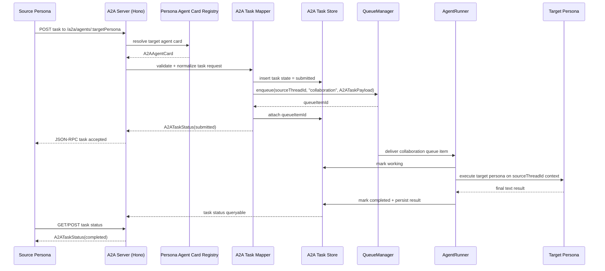

# A2A Protocol Integration Milestone 1

> Status: Draft
> Date: 2026-03-29
> Proposal source: `/home/talon/cf-notes/2026-03-27-inter-persona-communication-proposal.md` (Option 2b)

## Goal

Add an internal-only A2A layer for persona-to-persona task submission in Talon without introducing a public HTTP surface yet. Milestone 1 should prove the core shape:

- each loaded persona can be exposed as an A2A agent
- A2A task submission maps onto Talon's existing `collaboration` queue
- task lifecycle state is durable and queryable
- the target persona executes inside the existing `AgentRunner`/provider stack

This milestone is intentionally not a full external A2A product surface. It is the minimum Talon-native integration that validates the protocol choice from Option 2b.

## Current constraints

- TypeScript `strict` mode
- Node.js 22+, ES modules
- functional error handling with `neverthrow` `Result<T, E>`
- structured logging with `pino` via `createLogger` from `src/core/logging/`
- existing durable queue API: `QueueManager.enqueue(threadId, 'collaboration', payload)`
- existing persona config shape:
  - `name`
  - `model`
  - `systemPromptFile`
  - `skills[]`
  - `capabilities.allow[]`
  - `capabilities.requireApproval[]`
- no existing general-purpose HTTP server in the daemon
- tests mirror `src/` structure and use Vitest

## Milestone 1 scope

Milestone 1 includes:

- an internal Hono-based A2A server surface
- persona-to-agent-card mapping from `LoadedPersona`
- task submission/status/result lifecycle for text-only tasks
- queue-backed execution using `collaboration` items
- `AgentRunner` support for A2A collaboration execution that does not send replies back to the external channel
- unit coverage for card generation, task mapping, and server behavior
- one end-to-end integration test for the queue-backed task flow

Milestone 1 does not include:

- external/public endpoint exposure
- authentication/authorization for remote callers
- monitoring UI

Additional deferrals for M1:

- no SSE/webhook streaming
- no multimodal/file parts
- no cross-process federation with external agents
- no `input-required` round-trip UX beyond storing the state shape

## Architecture overview

### High-level design

Talon will add an internal A2A subsystem under `src/a2a/` with three core responsibilities:

1. `persona-agent-card`
   - converts loaded personas into A2A-discoverable agent cards
   - caches cards by persona name
   - invalidates/rebuilds on daemon reload

2. `a2a-task-mapper`
   - validates inbound A2A task requests
   - resolves the target persona
   - persists initial task state
   - enqueues a `collaboration` queue item using the originating thread ID
   - maps queue/run outcomes back into A2A task lifecycle states

3. `a2a-server`
   - owns the Hono app
   - serves agent cards and JSON-RPC task endpoints
   - adapts HTTP/JSON-RPC requests into local `Result`-returning services
   - remains internal-only in M1 by exposing an in-process `fetch()` handler rather than binding a public port

### Why internal-only first

Option 2b is about adopting the A2A protocol, not about prematurely publishing Talon on the network. M1 should use the protocol and SDK shape internally, but keep the transport private:

- no daemon socket binding changes
- no auth design yet
- no public trust boundary
- easier TDD because the Hono app can be tested through `app.request()`

This keeps M1 small while preserving the future path to a loopback or public listener later.

### Persona mapping

Each loaded persona becomes one logical A2A agent:

- agent identity key: `persona.config.name`
- display name: `persona.config.name`
- model, skills, and capability policy are published in card metadata
- card URL path: `/a2a/agents/:personaName`

M1 should derive cards only from already-loaded personas. No separate A2A registry config is needed.

### Queue integration

M1 reuses the existing thread that originated the collaboration request.

That means:

- the A2A task keeps `sourceThreadId`
- the queue item is enqueued on `sourceThreadId`
- the target persona runs against the same thread context/history
- no synthetic internal channel or collaboration-thread schema is required in M1

This is the smallest change that still gives persona-to-persona delegation.

### Execution path

1. caller submits an A2A task targeting a persona card
2. `A2ATaskMapper` validates text payload and resolves the target persona ID
3. mapper persists an `a2a_tasks` row with state `submitted`
4. mapper enqueues a `collaboration` queue item containing an `A2ATaskPayload`
5. `AgentRunner` detects `payload.kind === 'a2a_task'`
6. `AgentRunner` runs the target persona through the normal provider/runtime pipeline
7. instead of sending the final text to the external channel, it stores the result in the A2A task record
8. A2A status becomes `completed` or `failed`

### Daemon wiring

Bootstrap/runtime changes:

- `bootstrap()` constructs an `A2AServer` after persona loading and queue wiring
- `DaemonContext` gains `a2aServer`
- `TalondDaemon.start()` does not call `listen()` in M1
- internal callers use `ctx.a2aServer.fetch(request)` or a thin wrapper such as `submitInternalTask(...)`

## File structure

### New files under `src/a2a/`

```text
src/a2a/
  a2a-types.ts
  persona-agent-card.ts
  a2a-task-mapper.ts
  a2a-server.ts
  index.ts
```

Recommended responsibilities:

- `a2a-types.ts`
  - local normalized interfaces for cards, task payloads, and task status
  - narrow unions used by Talon regardless of SDK transport details
- `persona-agent-card.ts`
  - `LoadedPersona` -> `A2AAgentCard`
  - card registry/cache helpers
- `a2a-task-mapper.ts`
  - request validation
  - persona lookup
  - queue payload mapping
  - task state mapping between Talon and A2A lifecycle
- `a2a-server.ts`
  - Hono app construction
  - well-known card route(s)
  - JSON-RPC task routes
  - conversion between `Result` errors and protocol errors
- `index.ts`
  - barrel exports

### New files under `tests/unit/a2a/`

```text
tests/unit/a2a/
  persona-agent-card.test.ts
  a2a-task-mapper.test.ts
  a2a-server.test.ts
```

### Supporting non-`src/a2a` changes

These are still needed even though the new feature lives under `src/a2a/`:

- `src/daemon/daemon-context.ts`
  - add `a2aServer`
- `src/daemon/daemon-bootstrap.ts`
  - construct and inject `A2AServer`
- `src/daemon/daemon.ts`
  - lifecycle ownership if later promoted to a real listener
- `src/daemon/agent-runner.ts`
  - detect/execute `a2a_task` collaboration payloads
  - update A2A task state/result instead of sending to the channel connector
- `src/core/database/migrations/`
  - add one migration for `a2a_tasks`
- `src/core/database/repositories/`
  - add `A2ATaskRepository`
- `tests/integration/a2a-task-flow.test.ts`
  - end-to-end queue-backed task flow

## Dependencies to add

Add:

- `@a2a-js/sdk`
- `hono`

Do not add:

- `@a2aproject/a2a-js`

Implementation note:

- use `@a2a-js/sdk` for protocol models/handlers
- keep Hono as Talon's HTTP adapter because the project has no server stack yet and M1 should not pull in Express just to match SDK examples

## TypeScript interfaces

These are Talon-local interfaces. They intentionally normalize what Talon needs from the protocol instead of leaking raw SDK types through the daemon.

### `A2AAgentCard`

```ts
export interface A2AAgentCard {
  id: string; // stable: persona name
  name: string;
  description: string;
  url: string; // internal route, e.g. /a2a/agents/software-engineer
  version: string; // start with Talon package version or "0.1.0"
  skills: Array<{
    id: string;
    name: string;
    description?: string;
  }>;
  defaultInputModes: string[];  // M1: ["text/plain"]
  defaultOutputModes: string[]; // M1: ["text/plain"]
  metadata: {
    personaName: string;
    model: string;
    systemPromptFile?: string;
    skills: string[];
    capabilities: {
      allow: string[];
      requireApproval: string[];
    };
    internalOnly: true;
  };
}
```

Notes:

- `description` should come from persona frontmatter when available, otherwise fall back to a generated string such as `"Talon persona: <name>"`
- `skills` mirrors `PersonaConfig.skills`
- capability policy is metadata, not auth

### `A2ATaskPayload`

```ts
export interface A2ATaskPayload {
  kind: 'a2a_task';
  taskId: string;
  sourcePersona: string;
  targetPersona: string;
  sourceThreadId: string;
  personaId: string; // target persona DB id for AgentRunner
  content: string; // normalized text task body
  messageId?: string;
  parentTaskId?: string;
  hopCount: number;
  submittedAt: number;
  metadata: {
    agentCardId: string;
    traceId?: string;
    maxHops: number;
    queueType: 'collaboration';
  };
}
```

Notes:

- `personaId` is required because `AgentRunner` already expects `payload.personaId`
- `hopCount` enables loop protection
- `content` is the text extracted from the incoming A2A message parts in M1

### `A2ATaskStatus`

```ts
export type A2ATaskState =
  | 'submitted'
  | 'working'
  | 'input-required'
  | 'completed'
  | 'failed'
  | 'canceled';

export interface A2ATaskStatus {
  taskId: string;
  state: A2ATaskState;
  sourcePersona: string;
  targetPersona: string;
  threadId: string;
  queueItemId?: string;
  runId?: string;
  submittedAt: number;
  updatedAt: number;
  completedAt?: number;
  result?: {
    text: string;
  };
  error?: {
    code: string;
    message: string;
  };
  usage?: {
    inputTokens: number;
    outputTokens: number;
    costUsd?: number;
  };
}
```

Notes:

- M1 should persist this shape in an `a2a_tasks` table as JSON columns or normalized fields
- `input-required` exists for forward compatibility even if M1 does not implement the full reply loop

## Persistence model

Add an `a2a_tasks` table because the current queue schema is not sufficient to durably store:

- A2A lifecycle state independent of queue retry state
- final response payload
- source/target persona identity
- loop-control metadata such as `parentTaskId` and `hopCount`

Recommended row shape:

```sql
CREATE TABLE a2a_tasks (
  id              TEXT PRIMARY KEY,
  source_persona  TEXT NOT NULL,
  target_persona  TEXT NOT NULL,
  thread_id       TEXT NOT NULL REFERENCES threads(id) ON DELETE CASCADE,
  queue_item_id   TEXT REFERENCES queue_items(id),
  run_id          TEXT REFERENCES runs(id),
  state           TEXT NOT NULL
                  CHECK (state IN ('submitted', 'working', 'input-required', 'completed', 'failed', 'canceled')),
  request_payload TEXT NOT NULL,
  result_payload  TEXT,
  error_code      TEXT,
  error_message   TEXT,
  hop_count       INTEGER NOT NULL DEFAULT 0,
  parent_task_id  TEXT REFERENCES a2a_tasks(id),
  submitted_at    INTEGER NOT NULL,
  updated_at      INTEGER NOT NULL,
  completed_at    INTEGER
);

CREATE INDEX idx_a2a_tasks_thread ON a2a_tasks(thread_id, submitted_at DESC);
CREATE INDEX idx_a2a_tasks_state ON a2a_tasks(state, updated_at DESC);
CREATE INDEX idx_a2a_tasks_target ON a2a_tasks(target_persona, state, submitted_at DESC);
```

Repository methods:

- `insertSubmitted(task)`
- `attachQueueItem(taskId, queueItemId)`
- `markWorking(taskId, runId)`
- `markCompleted(taskId, result, usage?)`
- `markFailed(taskId, code, message)`
- `markCanceled(taskId)`
- `findById(taskId)`
- `findRecentByThread(threadId)`

All repository methods should return `Result<T, DbError>`.

## A2A server shape

### Routes

M1 should expose these Hono routes internally:

- `GET /.well-known/agent-card.json`
  - returns an index card or directory payload for all loaded personas
- `GET /a2a/agents/:personaName/.well-known/agent-card.json`
  - returns the agent card for one persona
- `POST /a2a/agents/:personaName`
  - JSON-RPC entrypoint for A2A task operations (note: `@a2a-js/sdk` integration deferred to M2)

### Internal transport model

M1 should not bind a port. The Hono app is used via:

```ts
const response = await a2aServer.fetch(
  new Request('http://talon.internal/a2a/agents/software-engineer', {
    method: 'POST',
    headers: { 'content-type': 'application/json' },
    body: JSON.stringify(jsonRpcBody),
  }),
);
```

That gives:

- protocol-conformant request/response handling
- no new network config
- deterministic unit tests

### Error mapping

`a2a-server.ts` should translate internal `Result` errors into protocol errors:

- unknown persona -> not found / invalid params
- malformed text parts -> invalid params
- queue enqueue failure -> internal error
- loop-limit exceeded -> rejected request
- approval-required execution failure -> failed task state

Each error response should also log structured fields:

- `a2aTaskId`
- `sourcePersona`
- `targetPersona`
- `threadId`
- `queueItemId`

## AgentRunner integration

`AgentRunner` currently treats `collaboration` items only as background-task notifications or normal persona runs that eventually send a channel reply.

M1 requires a new A2A-specific collaboration path:

1. detect `item.type === 'collaboration'` and `payload.kind === 'a2a_task'`
2. load the target persona from `payload.personaId`
3. create/update the A2A task record to `working`
4. execute the target persona using the existing provider/runtime flow
5. capture the final assistant text
6. store the text in `a2a_tasks.result_payload`
7. mark the task `completed`
8. skip `connector.send(...)` to the external channel

Failure path:

- persist `failed` state
- include a stable internal error code
- preserve queue retry semantics only for transient infrastructure failures

Recommended implementation detail:

- factor the existing "execute provider query and collect final text" block into a shared private helper so both normal message runs and A2A runs use the same core provider logic

## Queue integration details

### Queue payload mapping

`A2ATaskMapper` should call:

```ts
queueManager.enqueue(sourceThreadId, 'collaboration', payload)
```

Where `payload` is the normalized `A2ATaskPayload`.

### Queue priority

Current queue processing is FIFO by thread age and does not prioritize by item type. That is acceptable today for light collaboration traffic, but A2A makes starvation a real risk.

M1 should add a small supporting change:

- process eligible threads in type priority order:
  - `message`
  - `schedule`
  - `collaboration`

Minimal implementation options:

- sort `findPending()` output by type priority before deduplicating thread IDs in `QueueProcessor`
- or add a priority-aware pending query in `QueueRepository`

The repository/query option is preferable because it keeps priority deterministic and testable at the storage boundary.

### Concurrency guard

Add one collaboration admission-control rule in M1:

- max one active A2A collaboration per target persona at a time

That avoids one noisy persona consuming all queue slots.

## Mermaid sequence diagram



## TDD task breakdown order

Implement in this order:

1. `persona-agent-card`
   - tests first for persona -> card mapping
   - validate fallback description, skills mapping, capability metadata, internal URL generation

2. `a2a-task-mapper`
   - tests first for:
     - text-part extraction
     - persona lookup
     - task persistence
     - queue payload generation
     - loop-limit rejection

3. `a2a-server`
   - tests first for:
     - well-known card routes
     - JSON-RPC task submission
     - error translation from `Result` to protocol responses
     - internal `fetch()` execution without a bound port

4. integration test
   - real SQLite + migrations + queue manager + A2A server
   - submit a task for a target persona
   - assert:
     - task row created
     - queue item created as `collaboration`
     - runner marks task `working`
     - final text stored as `completed`
     - no outbound channel message is sent for the A2A task itself

## Risk and mitigations

### Infinite loops

Risk:

- persona A submits to persona B
- persona B submits back to persona A
- the system burns queue slots and tokens without user value

Mitigations:

- persist `hopCount` and reject any task above `maxHops` (start with `4`)
- persist `parentTaskId` so task lineage is inspectable
- reject same-thread immediate ping-pong patterns for the same source/target pair within a cooldown window
- log loop rejections with `warn` level and structured task lineage metadata

### Cost growth

Risk:

- every A2A exchange is another full agent run
- recursive delegation can multiply cost quickly

Mitigations:

- persist usage/cost on `A2ATaskStatus`
- add per-task soft budget metadata and fail closed when exceeded
- set a lower max-turn budget for A2A collaboration runs than user-facing runs
- emit dedicated logger fields for A2A cost tracking even though monitoring UI is out of scope

### Queue starvation

Risk:

- collaboration tasks can crowd out normal user work

Mitigations:

- queue priority ordering: `message > schedule > collaboration`
- one active collaboration per target persona
- keep collaboration submission on the existing thread so per-thread FIFO still prevents interleaved runs

## Logging and error-handling requirements

- all A2A services return `Result<T, E>` internally
- Hono handlers are thin adapters that unwrap `Result` into protocol responses
- use child loggers with:
  - `threadId`
  - `persona`
  - `runId`
  - `a2aTaskId`
- avoid throwing for expected validation failures
- only throw for truly exceptional boundaries where an outer adapter converts to `Err`

## Out of scope for M1

- no external endpoint
- no auth
- no monitoring UI

Also deferred:

- SSE/webhook status streaming
- signed/public agent cards
- external agent discovery
- file/artifact parts
- full `input-required` resume loop

## Recommended acceptance criteria

- a loaded persona can be represented as an A2A agent card
- an internal caller can submit a text-only task to another persona through the Hono A2A surface
- submission persists an A2A task record and enqueues a `collaboration` queue item
- `AgentRunner` completes the task without sending an external channel reply
- the caller can query durable task status/result
- queue priority and collaboration admission control prevent obvious starvation cases
