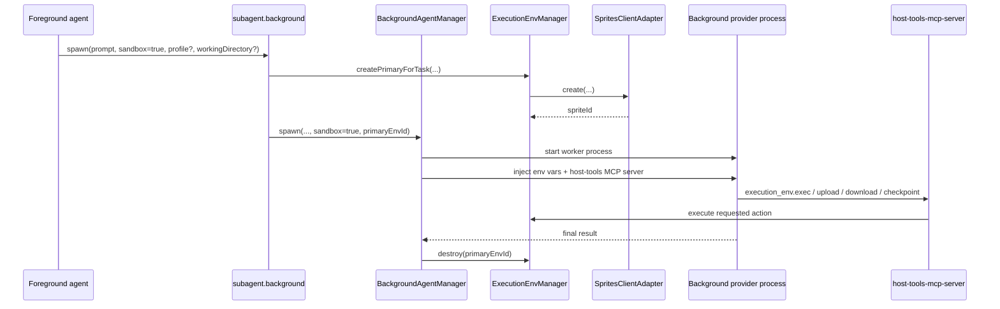
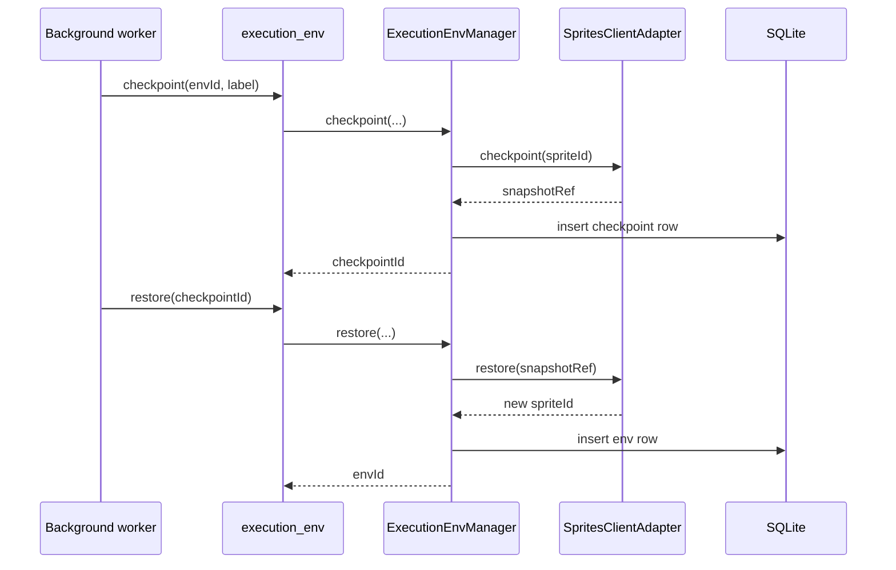

# Issue #116: Sprites.dev Execution Environments for Background Agents

## Overview

Issue #116 adds isolated, persistent Firecracker VM execution environments for background agents. A sandboxed background agent can install dependencies, build, run tests, start servers, and checkpoint/restore state without mutating the host filesystem or relying on host package managers.

This spec uses Sprites.dev via the `@fly/sprites` SDK behind a Talon-owned adapter. Talon code should not depend on raw SDK call names outside that adapter.

Why Sprites over the current host child-process model and over Docker-style alternatives:

- Firecracker VMs give materially stronger isolation than a host `cwd` plus provider-native shell/file tools.
- Sprites are persistent, so a long-running coding task can keep its dependencies, build outputs, and running services between tool calls.
- Checkpoint/restore is a first-class product feature; Docker would require Talon to invent its own snapshot semantics.
- The operational surface is smaller than managing a local hypervisor or VM fleet inside Talon.
- The SDK gives Talon one remote control plane for create, exec, upload, download, checkpoint, restore, and destroy.

Important current-codebase observation: the issue summary mentions `src/daemon/background-agent-manager.ts`, but the live implementation is [`src/subagents/background/background-agent-manager.ts`](/home/talon/workspace/talon/src/subagents/background/background-agent-manager.ts). This spec targets the current path.

Phase 1 goal:

- `background_agent action="spawn" sandbox=true` provisions a primary Sprite before the background agent process starts.
- The background worker gets Talon host tools, including a new `execution_env` tool.
- The primary Sprite is auto-destroyed when the task completes, fails, times out, is cancelled, or is orphaned by a daemon crash/restart.

Non-goals for Phase 1:

- Running the provider process itself inside the Sprite
- Automatic sync-back of the entire repo to the host on task completion
- Interactive terminal streaming from long-running processes

## Architecture

### High-level design

Talon adds a new execution-environment domain service, backed by Sprites:

- `ExecutionEnvManager`: Talon-owned orchestration layer
- `SpritesClientAdapter`: wrapper around `@fly/sprites`
- `ExecutionEnvRepository`: durable metadata for live environments
- `ExecutionEnvCheckpointRepository`: durable metadata for checkpoints
- `ExecutionEnvHandler`: new host tool exposed as `execution_env` / `execution.env`

`BackgroundAgentManager` integrates with `ExecutionEnvManager` when `sandbox: true` is requested. The manager creates a primary Sprite before spawning the provider process, injects environment metadata into the worker, and destroys the Sprite during all terminal cleanup paths.

### Critical codebase constraint

Today, background agents do **not** receive Talon's host-tools MCP server. That means `execution_env` would be unusable unless this issue also adds host-tool exposure for background workers.

This spec therefore includes:

- host-tools MCP injection for background workers
- capability filtering for background workers, matching `AgentRunner` behavior
- extra tool execution context so `execution_env` can safely scope host-side file access

### Proposed module layout

```text
src/execution-env/
  execution-env-types.ts
  execution-env-manager.ts
  sprites-client.ts
  sprites-client-adapter.ts
  path-policy.ts

src/tools/host-tools/
  execution-env.ts

src/core/database/repositories/
  execution-env-repository.ts
  execution-env-checkpoint-repository.ts
```

### Sequence: sandboxed background-agent spawn



### Sequence: checkpoint and restore



## New host tool: `execution_env`

### Naming and capability

- Internal tool name: `execution.env`
- MCP tool name: `execution_env`
- Capability label: `execution.env`

`tool-filter.ts` additions:

```ts
{ capabilityPrefix: 'execution.env', internalName: 'execution.env', mcpName: 'execution_env' }
```

Capability description:

```ts
{
  toolPrefix: 'execution.env',
  mcpName: 'execution_env',
  labels: [
    { label: 'execution.env', description: 'Manage isolated Sprite execution environments' },
  ],
}
```

### Handler location

New file:

- [`src/tools/host-tools/execution-env.ts`](/home/talon/workspace/talon/src/tools/host-tools/execution-env.ts)

Bridge registration:

- [`src/tools/host-tools-bridge.ts`](/home/talon/workspace/talon/src/tools/host-tools-bridge.ts)
- [`src/tools/host-tools-mcp-server.ts`](/home/talon/workspace/talon/src/tools/host-tools-mcp-server.ts)
- [`src/tools/tool-filter.ts`](/home/talon/workspace/talon/src/tools/tool-filter.ts)

### ToolExecutionContext additions

The existing `ToolExecutionContext` is insufficient because `execution_env` needs task-scoped context for host-path safety.

Proposed extension in [`src/tools/host-tools/channel-send.ts`](/home/talon/workspace/talon/src/tools/host-tools/channel-send.ts):

```ts
export interface ToolExecutionContext {
  runId: string;
  threadId: string;
  personaId: string;
  requestId?: string;
  traceparent?: string;
  backgroundTaskId?: string;
  primaryExecutionEnvId?: string;
  allowedHostRoots?: string[];
}
```

`host-tools-mcp-server.ts` will read and forward:

- `TALOND_BACKGROUND_TASK_ID`
- `TALOND_PRIMARY_EXECUTION_ENV_ID`
- `TALOND_ALLOWED_HOST_ROOTS` as JSON array

### TypeScript API

```ts
export interface ExecutionEnvArgs {
  action: 'create' | 'exec' | 'upload' | 'download' | 'checkpoint' | 'restore' | 'destroy';
  envId?: string;
  checkpointId?: string;
  label?: string;
  command?: string;
  cwd?: string;
  timeoutMs?: number;
  detach?: boolean;
  env?: Record<string, string>;
  sourcePath?: string;
  destinationPath?: string;
  recursive?: boolean;
  overwrite?: boolean;
  sandboxProfile?: string;
  baseSnapshot?: string;
  workingDirectory?: string;
  autoDestroy?: boolean;
  resourceLimits?: Partial<ExecutionEnvResourceLimits>;
}

export interface ExecutionEnvResourceLimits {
  cpus: number;
  memoryMb: number;
  diskGb: number;
}

export interface ExecutionEnvironment {
  id: string;
  provider: 'sprites';
  spriteId: string;
  threadId: string;
  personaId: string;
  ownerTaskId: string | null;
  status: 'creating' | 'ready' | 'busy' | 'checkpointing' | 'restoring' | 'destroying' | 'destroyed' | 'failed';
  workingDirectory: string;
  baseSnapshot: string | null;
  autoDestroy: boolean;
  resourceLimits: ExecutionEnvResourceLimits;
  createdAt: number;
  updatedAt: number;
  destroyedAt: number | null;
}

export interface ExecutionEnvExecResult {
  envId: string;
  status: 'completed' | 'running';
  exitCode: number | null;
  stdout: string;
  stderr: string;
  timedOut: boolean;
  processId?: string;
}

export interface ExecutionEnvCheckpoint {
  id: string;
  envId: string;
  provider: 'sprites';
  remoteRef: string;
  label: string | null;
  status: 'creating' | 'ready' | 'failed';
  createdAt: number;
}
```

### Action contract

#### `create`

Purpose:

- Create a new Sprite execution environment
- Optionally attach it to the current background task

Required input:

- `action: "create"`

Optional input:

- `baseSnapshot`
- `workingDirectory`
- `autoDestroy`
- `resourceLimits`
- `label`

Success result:

```json
{
  "env": {
    "id": "env_123",
    "provider": "sprites",
    "spriteId": "spr_abc",
    "status": "ready",
    "workingDirectory": "/workspace",
    "baseSnapshot": "node-22-bookworm",
    "autoDestroy": true,
    "resourceLimits": {
      "cpus": 2,
      "memoryMb": 4096,
      "diskGb": 20
    }
  }
}
```

Notes:

- For sandboxed background workers, manual `create` is allowed, but the default path is auto-provisioned primary env creation during `background_agent.spawn`.
- If `context.backgroundTaskId` is set, `ownerTaskId` defaults to that task.

#### `exec`

Purpose:

- Run a command inside a Sprite
- Supports short-lived commands and detached processes for dev servers

Required input:

- `action: "exec"`
- `envId`
- `command`

Optional input:

- `cwd`
- `timeoutMs`
- `detach`
- `env`

Success result for synchronous command:

```json
{
  "exec": {
    "envId": "env_123",
    "status": "completed",
    "exitCode": 0,
    "stdout": "tests passed",
    "stderr": "",
    "timedOut": false
  }
}
```

Success result for detached process:

```json
{
  "exec": {
    "envId": "env_123",
    "status": "running",
    "exitCode": null,
    "stdout": "",
    "stderr": "",
    "timedOut": false,
    "processId": "proc_456"
  }
}
```

Phase 1 detached-process constraint:

- Talon only guarantees that the process continues running inside the Sprite.
- Process inspection and stop/restart APIs are not part of Phase 1.

#### `upload`

Purpose:

- Copy files from the host-scoped control area into the Sprite

Required input:

- `action: "upload"`
- `envId`
- `sourcePath`
- `destinationPath`

Optional input:

- `recursive`

Success result:

```json
{
  "transfer": {
    "direction": "upload",
    "envId": "env_123",
    "sourcePath": "./patches/fix.diff",
    "destinationPath": "/workspace/patches/fix.diff",
    "bytes": 812
  }
}
```

Host-path safety rules:

- `sourcePath` must resolve inside `context.allowedHostRoots`
- absolute paths outside those roots are rejected
- in sandboxed background workers, `allowedHostRoots` defaults to the per-task control directory only

#### `download`

Purpose:

- Copy artifacts from the Sprite into the host-scoped control area

Required input:

- `action: "download"`
- `envId`
- `sourcePath`
- `destinationPath`

Optional input:

- `overwrite`

Success result:

```json
{
  "transfer": {
    "direction": "download",
    "envId": "env_123",
    "sourcePath": "/workspace/test-results/junit.xml",
    "destinationPath": "./artifacts/junit.xml",
    "bytes": 4521
  }
}
```

#### `checkpoint`

Purpose:

- Persist the current Sprite state as a restoreable checkpoint

Required input:

- `action: "checkpoint"`
- `envId`

Optional input:

- `label`

Success result:

```json
{
  "checkpoint": {
    "id": "ckpt_789",
    "envId": "env_123",
    "provider": "sprites",
    "remoteRef": "snap_xyz",
    "label": "post-install",
    "status": "ready"
  }
}
```

#### `restore`

Purpose:

- Create a new Sprite from a prior checkpoint

Required input:

- `action: "restore"`
- `checkpointId`

Optional input:

- `workingDirectory`
- `autoDestroy`
- `resourceLimits`

Success result:

```json
{
  "env": {
    "id": "env_restored_1",
    "provider": "sprites",
    "spriteId": "spr_restored_1",
    "status": "ready",
    "workingDirectory": "/workspace",
    "baseSnapshot": "snap_xyz",
    "autoDestroy": true
  }
}
```

#### `destroy`

Purpose:

- Tear down a Sprite and mark the local env row destroyed

Required input:

- `action: "destroy"`
- `envId`

Success result:

```json
{
  "destroyed": true,
  "envId": "env_123"
}
```

### Error handling

The transport only supports `status: "error"` plus a string message, so error codes must be encoded in the message and logged structurally.

Internal error code enum:

```ts
export type ExecutionEnvErrorCode =
  | 'ENV_NOT_FOUND'
  | 'CHECKPOINT_NOT_FOUND'
  | 'SPRITES_NOT_CONFIGURED'
  | 'SPRITES_AUTH_FAILED'
  | 'SPRITES_CREATE_FAILED'
  | 'SPRITES_EXEC_FAILED'
  | 'SPRITES_TRANSFER_FAILED'
  | 'SPRITES_CHECKPOINT_FAILED'
  | 'SPRITES_RESTORE_FAILED'
  | 'SPRITES_DESTROY_FAILED'
  | 'HOST_PATH_NOT_ALLOWED'
  | 'INVALID_ARGUMENT'
  | 'NOT_TASK_OWNER';
```

Returned error format:

```text
execution_env: [HOST_PATH_NOT_ALLOWED] sourcePath "/etc/passwd" is outside allowed roots
```

Timeout behavior:

- tool transport timeout remains 30s at the bridge level unless explicitly raised
- `execution_env exec` should prefer command-specific `timeoutMs`
- long-running work should use `detach: true`

### Sprites adapter interface

Talon code should talk to an internal adapter, not directly to the SDK:

```ts
export interface SpritesClientAdapter {
  create(input: {
    baseSnapshot?: string;
    resourceLimits: ExecutionEnvResourceLimits;
    workingDirectory: string;
    metadata: Record<string, string>;
  }): Promise<{
    spriteId: string;
  }>;

  exec(input: {
    spriteId: string;
    command: string;
    cwd: string;
    timeoutMs: number;
    detach?: boolean;
    env?: Record<string, string>;
  }): Promise<{
    exitCode: number | null;
    stdout: string;
    stderr: string;
    timedOut: boolean;
    processId?: string;
  }>;

  upload(input: {
    spriteId: string;
    sourcePath: string;
    destinationPath: string;
    recursive?: boolean;
  }): Promise<{ bytes: number }>;

  download(input: {
    spriteId: string;
    sourcePath: string;
    destinationPath: string;
    overwrite?: boolean;
  }): Promise<{ bytes: number }>;

  checkpoint(input: {
    spriteId: string;
    label?: string;
  }): Promise<{ remoteRef: string }>;

  restore(input: {
    remoteRef: string;
    resourceLimits: ExecutionEnvResourceLimits;
    workingDirectory: string;
    metadata: Record<string, string>;
  }): Promise<{ spriteId: string }>;

  destroy(spriteId: string): Promise<void>;
}
```

## BackgroundAgentManager changes

### Spawn API changes

`BackgroundAgentArgs` in [`src/tools/host-tools/background-agent.ts`](/home/talon/workspace/talon/src/tools/host-tools/background-agent.ts):

```ts
export interface BackgroundAgentArgs {
  action: 'spawn' | 'status' | 'cancel' | 'result' | 'profiles';
  prompt?: string;
  taskId?: string;
  provider?: string;
  profile?: string;
  workingDirectory?: string;
  timeoutMinutes?: number;
  sandbox?: boolean;
}
```

`SpawnBackgroundAgentInput` in [`src/subagents/background/background-agent-manager.ts`](/home/talon/workspace/talon/src/subagents/background/background-agent-manager.ts):

```ts
export interface SpawnBackgroundAgentInput {
  prompt: string;
  personaPrompt: string;
  threadContext?: string;
  mcpServers: Record<string, CanonicalMcpServer>;
  personaId: string;
  threadId: string;
  channelId: string;
  channelName: string;
  provider?: string;
  profileName?: string;
  model?: string;
  workingDirectory?: string;
  timeoutMinutes?: number;
  traceparent?: string;
  sandbox?: boolean;
  primaryExecutionEnvId?: string;
  controlDirectory?: string;
}
```

### Required behavior changes

#### `BackgroundAgentHandler.spawn`

New responsibilities:

- resolve `sandbox` as `args.sandbox ?? loadedPersona.config.executionEnv?.sandboxDefault ?? false`
- validate `execution.env` capability on the selected profile when sandboxing is requested
- build a background-worker host-tools MCP server, matching the `AgentRunner` pattern
- always filter out `background_agent` from the background worker's allowed tools in Phase 1
- when `sandbox=true`, create a per-task control directory on host, not the real repo `cwd`

Important semantic change:

- `workingDirectory` remains the host source directory for initial seeding into the Sprite
- the provider process `cwd` becomes the per-task control directory when sandboxing is enabled

This avoids granting the provider process direct access to the host repo while still letting Talon upload source files into the Sprite before the agent starts.

#### `BackgroundAgentManager` lifecycle

Current `spawn()` is synchronous. With Sprites provisioning, it must become async.

Proposed signatures:

```ts
spawn(input: SpawnBackgroundAgentInput): Promise<Result<string, BackgroundAgentError>>;
cancel(taskId: string): Promise<Result<boolean, BackgroundAgentError>>;
recoverOrphanedTasks(): Promise<void>;
shutdown(): Promise<void>;
```

Cleanup paths that must destroy the primary Sprite:

- normal completion
- provider-reported failure
- timeout
- explicit cancellation
- daemon shutdown
- orphan recovery on restart

### New background-task metadata

Extend `BackgroundTask`:

```ts
export interface BackgroundTask {
  id: string;
  personaId: string;
  providerName: string;
  threadId: string;
  channelId: string;
  prompt: string;
  workingDirectory: string | null;
  status: BackgroundTaskStatus;
  output: string | null;
  error: string | null;
  pid: number | null;
  createdAt: number;
  startedAt: number;
  completedAt: number | null;
  timeoutMinutes: number;
  parentTraceparent: string | null;
  sandboxEnabled: boolean;
  primaryExecutionEnvId: string | null;
}
```

Migration in Phase 1:

```sql
ALTER TABLE background_tasks ADD COLUMN sandbox_enabled INTEGER NOT NULL DEFAULT 0;
ALTER TABLE background_tasks ADD COLUMN primary_execution_env_id TEXT;
CREATE INDEX idx_background_tasks_primary_execution_env_id
  ON background_tasks(primary_execution_env_id);
```

### Environment variable injection

Inject into the provider child process:

- `TALON_BACKGROUND_TASK_ID`
- `TALON_PRIMARY_EXECUTION_ENV_ID`
- `TALON_PRIMARY_EXECUTION_ENV_CWD`

Inject into the background worker host-tools MCP server:

- `TALOND_SOCKET`
- `TALOND_RUN_ID`
- `TALOND_THREAD_ID`
- `TALOND_PERSONA_ID`
- `TALOND_ALLOWED_TOOLS`
- `TALOND_TRACEPARENT`
- `TALOND_BACKGROUND_TASK_ID`
- `TALOND_PRIMARY_EXECUTION_ENV_ID`
- `TALOND_ALLOWED_HOST_ROOTS`

### Seed upload flow

When `sandbox=true` and `workingDirectory` is provided:

1. create primary Sprite
2. upload `workingDirectory` contents into Sprite `workingDirectory` path
3. spawn provider process

If upload fails:

- mark task failed
- destroy Sprite
- remove control directory

## Config schema changes

### New top-level `sprites` config

Add to [`src/core/config/config-schema.ts`](/home/talon/workspace/talon/src/core/config/config-schema.ts):

```ts
const ExecutionEnvResourceLimitsSchema = z.object({
  cpus: z.number().min(0.25).default(2),
  memoryMb: z.number().int().min(256).default(4096),
  diskGb: z.number().int().min(1).default(20),
});

export const SpritesConfigSchema = z
  .object({
    enabled: z.boolean().default(false),
    token: z.string().default(''),
    apiBaseUrl: z.string().url().default('https://api.sprites.dev'),
    defaultBaseSnapshot: z.string().optional(),
    workingDirectory: z.string().default('/workspace'),
    createTimeoutMs: z.number().int().min(1000).default(60_000),
    execTimeoutMs: z.number().int().min(1000).default(20 * 60 * 1000),
    autoDestroyOnCompletion: z.boolean().default(true),
    resourceLimits: ExecutionEnvResourceLimitsSchema.default(() =>
      ExecutionEnvResourceLimitsSchema.parse({}),
    ),
  })
  .superRefine((value, ctx) => {
    if (!value.enabled) return;
    if (value.token.trim().length === 0) {
      ctx.addIssue({
        code: z.ZodIssueCode.custom,
        path: ['token'],
        message: 'token is required when sprites.enabled is true',
      });
    }
  });
```

Add to root schema:

```ts
sprites: SpritesConfigSchema.default(() => SpritesConfigSchema.parse({})),
```

### Persona-level defaults

Extend `PersonaConfigSchema`:

```ts
const PersonaExecutionEnvSchema = z.object({
  sandboxDefault: z.boolean().default(false),
  baseSnapshot: z.string().optional(),
  workingDirectory: z.string().default('/workspace'),
  resourceLimits: ExecutionEnvResourceLimitsSchema.partial().default({}),
});

export const PersonaConfigSchema = z.object({
  // existing fields...
  executionEnv: PersonaExecutionEnvSchema.optional(),
});
```

Semantics:

- `sandboxDefault` controls default `background_agent.spawn` behavior for that persona/profile
- `baseSnapshot` overrides global `sprites.defaultBaseSnapshot`
- persona `resourceLimits` override global defaults per spawned task

### YAML example

```yaml
sprites:
  enabled: true
  token: ${SPRITES_TOKEN}
  defaultBaseSnapshot: node-22-bookworm
  workingDirectory: /workspace
  resourceLimits:
    cpus: 2
    memoryMb: 4096
    diskGb: 20

personas:
  - name: software-engineer
    model: claude-sonnet-4-6
    provider: claude-code
    capabilities:
      allow:
        - subagent.background
        - execution.env
    executionEnv:
      sandboxDefault: true
      baseSnapshot: node-22-bookworm
      workingDirectory: /workspace
      resourceLimits:
        cpus: 4
        memoryMb: 8192
```

### Type exports

Update [`src/core/config/config-types.ts`](/home/talon/workspace/talon/src/core/config/config-types.ts):

```ts
export type SpritesConfig = z.infer<typeof SpritesConfigSchema>;
export type ExecutionEnvResourceLimitsConfig = z.infer<typeof ExecutionEnvResourceLimitsSchema>;
export type PersonaExecutionEnvConfig = PersonaConfig['executionEnv'];
```

## Phase 1 implementation plan

### 1. Dependency and config

Modify [`package.json`](/home/talon/workspace/talon/package.json):

- add `@fly/sprites`

Modify [`src/core/config/config-schema.ts`](/home/talon/workspace/talon/src/core/config/config-schema.ts):

- add `ExecutionEnvResourceLimitsSchema`
- add `SpritesConfigSchema`
- extend `PersonaConfigSchema` with `executionEnv`
- add `sprites` to `TalondConfigSchema`

Modify [`src/core/config/config-types.ts`](/home/talon/workspace/talon/src/core/config/config-types.ts):

- export new inferred config types

Modify [`src/core/config/config-loader.ts`](/home/talon/workspace/talon/src/core/config/config-loader.ts):

- no structural migration required
- tests must cover `${SPRITES_TOKEN}` substitution and `sprites.enabled=true` validation

### 2. Persistence

Create migration [`src/core/database/migrations/007-execution-environments.sql`](/home/talon/workspace/talon/src/core/database/migrations/007-execution-environments.sql):

```sql
CREATE TABLE execution_environments (
  id                TEXT PRIMARY KEY,
  provider          TEXT NOT NULL DEFAULT 'sprites',
  sprite_id         TEXT NOT NULL UNIQUE,
  thread_id         TEXT NOT NULL,
  persona_id        TEXT NOT NULL,
  owner_task_id     TEXT,
  status            TEXT NOT NULL
                    CHECK (status IN ('creating', 'ready', 'busy', 'checkpointing', 'restoring', 'destroying', 'destroyed', 'failed')),
  working_directory TEXT NOT NULL,
  base_snapshot     TEXT,
  auto_destroy      INTEGER NOT NULL DEFAULT 1,
  cpus              REAL NOT NULL,
  memory_mb         INTEGER NOT NULL,
  disk_gb           INTEGER NOT NULL,
  metadata_json     TEXT,
  created_at        INTEGER NOT NULL,
  updated_at        INTEGER NOT NULL,
  destroyed_at      INTEGER
);

CREATE INDEX idx_execution_env_thread_created
  ON execution_environments(thread_id, created_at DESC);
CREATE INDEX idx_execution_env_owner_task
  ON execution_environments(owner_task_id);
```

Create migration [`src/core/database/migrations/008-background-task-sandbox-columns.sql`](/home/talon/workspace/talon/src/core/database/migrations/008-background-task-sandbox-columns.sql):

```sql
ALTER TABLE background_tasks ADD COLUMN sandbox_enabled INTEGER NOT NULL DEFAULT 0;
ALTER TABLE background_tasks ADD COLUMN primary_execution_env_id TEXT;
CREATE INDEX idx_background_tasks_primary_execution_env_id
  ON background_tasks(primary_execution_env_id);
```

Create [`src/core/database/repositories/execution-env-repository.ts`](/home/talon/workspace/talon/src/core/database/repositories/execution-env-repository.ts):

Required methods:

```ts
create(input: CreateExecutionEnvironmentInput): Result<ExecutionEnvironment, DbError>;
findById(id: string): Result<ExecutionEnvironment | null, DbError>;
findByOwnerTaskId(taskId: string): Result<ExecutionEnvironment | null, DbError>;
findActive(): Result<ExecutionEnvironment[], DbError>;
updateStatus(id: string, status: ExecutionEnvironment['status']): Result<void, DbError>;
markDestroyed(id: string): Result<void, DbError>;
updateSpriteId(id: string, spriteId: string): Result<void, DbError>;
```

Modify [`src/core/database/repositories/index.ts`](/home/talon/workspace/talon/src/core/database/repositories/index.ts):

- export the new repository

### 3. Sprites integration layer

Create [`src/execution-env/execution-env-types.ts`](/home/talon/workspace/talon/src/execution-env/execution-env-types.ts):

- shared domain types for envs, checkpoints, create/exec/upload/download inputs

Create [`src/execution-env/sprites-client-adapter.ts`](/home/talon/workspace/talon/src/execution-env/sprites-client-adapter.ts):

- adapter interface only

Create [`src/execution-env/sprites-client.ts`](/home/talon/workspace/talon/src/execution-env/sprites-client.ts):

- concrete `@fly/sprites` implementation
- maps SDK errors into Talon `ExecutionEnvError`

Suggested constructor:

```ts
export class SpritesClient implements SpritesClientAdapter {
  constructor(private readonly config: SpritesConfig) {}
}
```

Create [`src/execution-env/path-policy.ts`](/home/talon/workspace/talon/src/execution-env/path-policy.ts):

- resolve and validate `sourcePath` / `destinationPath` against `allowedHostRoots`

Suggested function:

```ts
export function resolveAllowedHostPath(
  candidatePath: string,
  allowedRoots: string[],
): Result<string, ExecutionEnvError>;
```

Create [`src/execution-env/execution-env-manager.ts`](/home/talon/workspace/talon/src/execution-env/execution-env-manager.ts):

Suggested public API:

```ts
export class ExecutionEnvManager {
  constructor(private readonly deps: ExecutionEnvManagerDeps) {}

  create(input: CreateExecutionEnvironmentInput): Promise<Result<ExecutionEnvironment, ExecutionEnvError>>;
  exec(input: ExecExecutionEnvironmentInput): Promise<Result<ExecutionEnvExecResult, ExecutionEnvError>>;
  upload(input: UploadExecutionEnvironmentInput): Promise<Result<ExecutionEnvTransferResult, ExecutionEnvError>>;
  download(input: DownloadExecutionEnvironmentInput): Promise<Result<ExecutionEnvTransferResult, ExecutionEnvError>>;
  checkpoint(input: CheckpointExecutionEnvironmentInput): Promise<Result<ExecutionEnvCheckpoint, ExecutionEnvError>>;
  restore(input: RestoreExecutionEnvironmentInput): Promise<Result<ExecutionEnvironment, ExecutionEnvError>>;
  destroy(envId: string): Promise<Result<void, ExecutionEnvError>>;
  destroyOwnedByTask(taskId: string): Promise<void>;
  recoverOrphanedEnvironments(): Promise<void>;
}
```

### 4. Daemon bootstrap and context

Modify [`src/daemon/daemon-context.ts`](/home/talon/workspace/talon/src/daemon/daemon-context.ts):

```ts
readonly executionEnvManager: ExecutionEnvManager | null;
```

Modify [`src/daemon/daemon-bootstrap.ts`](/home/talon/workspace/talon/src/daemon/daemon-bootstrap.ts):

- instantiate `ExecutionEnvRepository`
- instantiate `SpritesClient` and `ExecutionEnvManager` when `config.sprites.enabled`
- call `await executionEnvManager.recoverOrphanedEnvironments()`
- pass `executionEnvManager` into `DaemonContext`

Modify [`src/daemon/daemon.ts`](/home/talon/workspace/talon/src/daemon/daemon.ts):

- `await this.ctx.backgroundAgentManager?.shutdown()`
- optionally `await this.ctx.executionEnvManager?.recoverOrphanedEnvironments()` is bootstrap-only, not stop-time

### 5. Host tools

Create [`src/tools/host-tools/execution-env.ts`](/home/talon/workspace/talon/src/tools/host-tools/execution-env.ts):

Suggested shape:

```ts
export interface ExecutionEnvArgs { /* union args above */ }

export class ExecutionEnvHandler {
  static readonly manifest: ToolManifest = {
    name: 'execution.env',
    description: 'Manage isolated Sprite execution environments for background tasks.',
    capabilities: ['execution.env'],
    executionLocation: 'host',
  };

  constructor(private readonly deps: {
    executionEnvManager: ExecutionEnvManager;
    logger: pino.Logger;
  }) {}

  async execute(args: ExecutionEnvArgs, context: ToolExecutionContext): Promise<ToolCallResult>;
}
```

Modify [`src/tools/host-tools/index.ts`](/home/talon/workspace/talon/src/tools/host-tools/index.ts):

- export handler and args

Modify [`src/tools/host-tools-bridge.ts`](/home/talon/workspace/talon/src/tools/host-tools-bridge.ts):

- create `executionEnvHandler`
- add dispatch case for `execution.env`
- return explicit error when manager is not initialized

Modify [`src/tools/host-tools-mcp-server.ts`](/home/talon/workspace/talon/src/tools/host-tools-mcp-server.ts):

- add `execution_env` tool entry with JSON schema
- parse new environment variables and include them in bridge context

Suggested MCP schema:

```ts
{
  name: 'execution_env',
  description: 'Create and manage isolated Sprite execution environments.',
  inputSchema: {
    type: 'object',
    properties: {
      action: {
        type: 'string',
        enum: ['create', 'exec', 'upload', 'download', 'checkpoint', 'restore', 'destroy'],
      },
      envId: { type: 'string' },
      checkpointId: { type: 'string' },
      command: { type: 'string' },
      cwd: { type: 'string' },
      timeoutMs: { type: 'number' },
      detach: { type: 'boolean' },
      sourcePath: { type: 'string' },
      destinationPath: { type: 'string' },
      recursive: { type: 'boolean' },
      overwrite: { type: 'boolean' },
      baseSnapshot: { type: 'string' },
      workingDirectory: { type: 'string' },
      autoDestroy: { type: 'boolean' },
    },
    required: ['action'],
  },
}
```

Modify [`src/tools/tool-filter.ts`](/home/talon/workspace/talon/src/tools/tool-filter.ts):

- register capability mapping and description

### 6. Background worker host-tools injection

Modify [`src/tools/host-tools/background-agent.ts`](/home/talon/workspace/talon/src/tools/host-tools/background-agent.ts):

- add `sandbox` arg validation
- compute allowed MCP tools from persona capabilities
- filter out `background_agent`
- include `execution_env` when permitted
- create per-task control directory when sandboxing
- pass host-tools MCP server into `SpawnBackgroundAgentInput.mcpServers`

Suggested helper:

```ts
private buildBackgroundHostToolsServer(input: {
  runId: string;
  threadId: string;
  personaId: string;
  taskId?: string;
  traceparent?: string;
  allowedMcpTools: string[];
  primaryExecutionEnvId?: string;
  allowedHostRoots?: string[];
}): CanonicalMcpServer
```

### 7. Background agent manager

Modify [`src/subagents/background/background-agent-manager.ts`](/home/talon/workspace/talon/src/subagents/background/background-agent-manager.ts):

- make `spawn`, `cancel`, `recoverOrphanedTasks`, and `shutdown` async
- persist `sandboxEnabled` and `primaryExecutionEnvId`
- on terminal paths call `await executionEnvManager.destroyOwnedByTask(taskId)` or direct destroy
- clean up control directories in addition to provider temp artifacts

Constructor deps gain:

```ts
executionEnvManager?: Pick<
  ExecutionEnvManager,
  'create' | 'upload' | 'destroy' | 'destroyOwnedByTask'
>;
spritesConfigEnabled: boolean;
dataDir: string;
```

### 8. Tests

Create or modify:

- [`tests/unit/core/config/config-schema.test.ts`](/home/talon/workspace/talon/tests/unit/core/config/config-schema.test.ts)
- [`tests/unit/core/config/config-loader.test.ts`](/home/talon/workspace/talon/tests/unit/core/config/config-loader.test.ts)
- [`tests/unit/tools/host-tools/execution-env.test.ts`](/home/talon/workspace/talon/tests/unit/tools/host-tools/execution-env.test.ts)
- [`tests/unit/tools/host-tools-bridge.test.ts`](/home/talon/workspace/talon/tests/unit/tools/host-tools-bridge.test.ts)
- [`tests/unit/tools/background-agent.test.ts`](/home/talon/workspace/talon/tests/unit/tools/background-agent.test.ts)
- [`tests/unit/subagents/background/background-agent-manager.test.ts`](/home/talon/workspace/talon/tests/unit/subagents/background/background-agent-manager.test.ts)
- [`tests/unit/daemon/daemon-bootstrap.test.ts`](/home/talon/workspace/talon/tests/unit/daemon/daemon-bootstrap.test.ts)

## Phase 2: Checkpoint/restore

### Persistence model

Create migration [`src/core/database/migrations/009-execution-env-checkpoints.sql`](/home/talon/workspace/talon/src/core/database/migrations/009-execution-env-checkpoints.sql):

```sql
CREATE TABLE execution_env_checkpoints (
  id            TEXT PRIMARY KEY,
  env_id        TEXT NOT NULL,
  provider      TEXT NOT NULL DEFAULT 'sprites',
  remote_ref    TEXT NOT NULL UNIQUE,
  label         TEXT,
  status        TEXT NOT NULL
                CHECK (status IN ('creating', 'ready', 'failed')),
  metadata_json TEXT,
  created_at    INTEGER NOT NULL,
  updated_at    INTEGER NOT NULL
);

CREATE INDEX idx_execution_env_checkpoints_env_created
  ON execution_env_checkpoints(env_id, created_at DESC);
```

Create [`src/core/database/repositories/execution-env-checkpoint-repository.ts`](/home/talon/workspace/talon/src/core/database/repositories/execution-env-checkpoint-repository.ts):

```ts
create(input: CreateExecutionEnvCheckpointInput): Result<ExecutionEnvCheckpoint, DbError>;
findById(id: string): Result<ExecutionEnvCheckpoint | null, DbError>;
findLatestByEnvId(envId: string): Result<ExecutionEnvCheckpoint | null, DbError>;
updateStatus(id: string, status: ExecutionEnvCheckpoint['status']): Result<void, DbError>;
```

### Semantics

- `checkpoint` always creates a new checkpoint row; it does not mutate the env row
- `restore` always creates a new env row; it does not resurrect the original env id
- env row `baseSnapshot` should store the checkpoint `remoteRef` when restored from a checkpoint
- checkpoint metadata should include resource limits and optional provenance:
  - original env id
  - original task id
  - git commit if known in Phase 3

### Restore policy

For Phase 2, restore is explicit only:

- no automatic restore during orphan recovery
- no automatic "resume last sandbox" for a new background task

This keeps failure handling simple and avoids surprising stale-state reuse.

## Phase 3: Software-engineer workflow

Phase 3 adds repo conventions so a software-engineer persona can get a useful sandbox with minimal prompt overhead.

### `.talon/sandbox.yaml`

Convention:

- file lives at repo root: `.talon/sandbox.yaml`
- background-agent spawn inspects it when `sandbox=true` and `workingDirectory` is a repo root

Example:

```yaml
version: 1
baseSnapshot: node-22-bookworm
workingDirectory: /workspace
resourceLimits:
  cpus: 4
  memoryMb: 8192
  diskGb: 40
seed:
  include:
    - package.json
    - pnpm-lock.yaml
    - tsconfig.json
    - src/**
    - tests/**
bootstrap:
  - pnpm install --frozen-lockfile
ports:
  - 3000
  - 4173
artifacts:
  - coverage/**
  - test-results/**
```

Phase 3 behaviors:

- seed only included files into the Sprite
- run bootstrap commands immediately after create/restore
- attach declared ports to detached server metadata
- allow `execution_env download` shorthand for declared artifacts

### Pre-built snapshots

Pre-built snapshots reduce setup time for common stacks:

- `node-22-bookworm`
- `python-3.12`
- `rust-stable`

Later optimization:

- derive snapshot cache keys from `.talon/sandbox.yaml` plus lockfile hashes
- if a matching checkpoint exists, restore instead of cold-creating

## Testing strategy

### Unit tests

Mock `SpritesClientAdapter`. Do not hit the real network in unit tests.

Coverage targets:

- config validation for `sprites.enabled` and missing token
- persona default sandbox resolution
- `execution_env` action validation and error messages
- host-path policy rejects paths outside `allowedHostRoots`
- background-agent spawn with `sandbox=true` creates env before process start
- background-agent failure path destroys env
- daemon shutdown awaits background-agent env cleanup
- orphan recovery destroys stale env rows and marks background tasks failed

### Integration tests

Add integration tests with a fake in-process Sprites adapter:

- sandboxed spawn uploads seed directory, executes `npm test`, and destroys env
- detached exec returns `status: "running"`
- checkpoint then restore yields a new env id and preserved filesystem state
- `execution_env download` writes only inside allowed roots

Prefer a fake adapter over live Sprites in CI. Live-provider smoke tests can be gated behind an opt-in environment variable later.

### Suggested test files

- [`tests/unit/tools/host-tools/execution-env.test.ts`](/home/talon/workspace/talon/tests/unit/tools/host-tools/execution-env.test.ts)
- [`tests/unit/execution-env/execution-env-manager.test.ts`](/home/talon/workspace/talon/tests/unit/execution-env/execution-env-manager.test.ts)
- [`tests/unit/execution-env/path-policy.test.ts`](/home/talon/workspace/talon/tests/unit/execution-env/path-policy.test.ts)
- [`tests/integration/e2e/background-agent-sprites.e2e.test.ts`](/home/talon/workspace/talon/tests/integration/e2e/background-agent-sprites.e2e.test.ts)

## Open questions

These need Ivo's decision before implementation starts:

1. Should Phase 1 be "provider process on host, work happens in Sprite via `execution_env`", or should we invest immediately in running the provider process itself inside the Sprite for stronger isolation?
2. Should a sandboxed background task ever auto-sync changed files back to the host repo on completion, or is explicit `download` the only allowed path?
3. What exact Sprites SDK operations are available today for file transfer, detached process execution, and checkpoint readiness polling? This spec assumes all of them exist behind an adapter.
4. What network policy should Sprites use by default: unrestricted egress, disabled egress, or an allowlist model?
5. Should `execution.env` be available only to sandboxed background workers in Phase 1, or should any persona with the capability get it in foreground runs too?
6. Should recursive background-agent spawning stay disabled permanently for sandboxed workers, or only for Phase 1?
7. What checkpoint retention policy is acceptable for cost control: per-task only, per-persona LRU, or manual cleanup only?
8. Are there quota or billing limits that require per-persona or per-daemon caps on concurrent Sprites beyond `backgroundAgent.maxConcurrent`?
